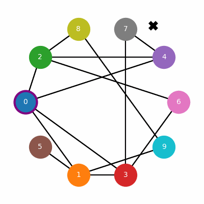

*At first glance, the cloak appears to be nothing more than a collection of rags stitched together haphazardly, frayed edges fluttering like whispers in the wind. Yet, as the old wizard wraps it tightly around his shoulders, the air shimmers with a soft, silvery glow. Each tattered piece of fabric is imbued with arcane runes, barely visible, that hum with ancient magic, shielding him from the piercing cold and prying eyes alike. This patchwork garment, a tapestry of secrets, has safeguarded many a hidden wisdom through the ages.*


## The Quest
Create a threadbare implementation of the Retrieval-Augmented Generation (RAG) toolkit.

## Why?
Using RAG lets us search documents by meaning instead of exact keywords. The matching documents are used to supplement the LLM context. This is useful for workflows that require asking questions from local documents on which the model hasn't been trained. Or isolate a specific paragraph in a book or paper to reduce the cost of long context queries.

## Compare Embeddings
I'll use a random off-the-shelf model to generate embeddings. If you want to read more about how Embeddings are created, take a look at my [Embeddings Necronomicon](/posts/embeddings-necronomicon/).

```python
from langchain_community.embeddings import HuggingFaceEmbeddings

embeddings = HuggingFaceEmbeddings()
def get_embedding(text):
    return torch.tensor(embeddings.embed_query(text))
```

Embeddings are N-dimensional vectors, and can be compared using cosine_similarity (or cosine_distance) which boils down to a dot product of normalized vectors.

```python
def cosine_similarity(embed1, embed2):
    norm_embed1 = embed1 / embed1.norm()
    norm_embed2 = embed2 / embed2.norm()
    return norm_embed1 @ norm_embed2.T

def cosine_distance(embed1, embed2):
    return 1 - cosine_similarity(embed1, embed2)
```

This gives us a way to compare how similar two blocks of text are:

```python
lemon = get_embedding('lemons are yellow')
lime = get_embedding('limes are green')
tomato = get_embedding('tomatoes are red')
rain = get_embedding('today is rainy')

print(f'distance between "lemon" and "lime" is   {cosine_distance(lemon, lime)}')
print(f'distance between "lemon" and "tomato" is {cosine_distance(lemon, tomato)}')
print(f'distance between "lemon" and "rain" is   {cosine_distance(lemon, rain)}')
```

```
distance between "lemon" and "lime" is   0.3547552824020386
distance between "lemon" and "tomato" is 0.5043934583663940
distance between "lemon" and "rain" is   0.7150339484214783
```

## Document Chunking
Once we identify the documents matching our query we can add them to the context. This approach has several drawbacks, including scalability issues, because attention is quadratic on the size of the context. The documents might not be relevent in their entirety diluting the focus of the query. For that reason we will look at how we can split the documents into smaller chunks.

For this section, I'll use the Wikipedia article on wizards as our document.

### Fixed Size
The simplest strategy is to split the documents into equally sized chunks. Here for simplicity of a fixed string size, but in practice it would be smarter to chunk it into a fixed number of tokens.

```python
def chunk_fixed_size(text, size):
    return [text[i:i+size] for i in range(0, len(text), size)]

chunks = chunk_fixed_size(document, 50)
chunks[:4]
```
```python
['Magicians appearing in fantasy fiction\n\nFor other ',
 'uses, see [Magician\n(disambiguation)](/wiki/Magici',
 'an_\\(disambiguation\\) "Magician\n\\(disambiguation\\)',
 '") and [Magi (disambiguation)](/wiki/Magi_\\(disamb']
```

Optionally we could also allow for overlaps between chunks.

```python
def chunk_fixed_size_overlap(text, size, overlap):
    return [text[i:i+size] for i in range(0, len(text), size - overlap)]

chunks = chunk_fixed_size_overlap(document, 50, 10)
chunks[:4]
```

```python
['Magicians appearing in fantasy fiction\n\nFor other ',
 'For other uses, see [Magician\n(disambiguation)](/w',
 'ation)](/wiki/Magician_\\(disambiguation\\) "Magicia',
 ') "Magician\n\\(disambiguation\\)") and [Magi (disamb']
```

### Recursive Character Split (RCS)
A more useful approach is to split the text based on a hierarchy of specific landmarks (e.g. `'\n\n'`, `'\n'`, `' '`) until we reach the desired size. This is meant to preserve more structure than simple fixed size split.

```python
def chunk_recursive_character_split(text, size, separators=['\n\n', '\n', ' ']):
    if len(text) <= size: return [text]
    for separator in separators + ['']:
        if (index := text[:size].rfind(separator)) != -1:
            index += len(separator)
            return [text[:index]] + chunk_recursive_character_split(text[index:], size, separators)

chunks = chunk_recursive_character_split(document, 50)
chunks[:4]
```

```python
['Magicians appearing in fantasy fiction\n\n',
 'For other uses, see [Magician\n',
 '(disambiguation)](/wiki/Magician_\\(disambiguation\\',
 ') "Magician\n']
```

It's a good default for chunking. In practice we'd use longer than 50 characters chunks depending on the capabilities of the embedding model we are using as well as the context size of our LLM.

### Document Specific Splitting
Or split based on the document specific grammar (e.g. markdown, HTML, PDF ...).

```python
def chunk_markdown(text, size, offset=0):
    ''' piggyback on recursive character split for the demo but it should use a markdown parser '''
    separators = [
        '\n# ', '\n## ', '\n### ', '\n#### ', '\n##### ', '\n###### ', # headings
        '```\n', '\n\n', # blocks
        '\n', '`', '[', ']', '(', ')', '*', '_', # inline
        ' ', # words
    ]
    if len(text) <= size: return [text]
    for separator in separators + ['']:
        if (index := text[offset:size].rfind(separator)) != -1:
            index += offset
            return [text[:index]] + chunk_markdown(text[index:], size, offset=len(separator))

doc = '''
# The Enigmatic Life of Wizard Eldrath

## Introduction
Eldrath the Wise, a wizard of great renown, has fascinated scholars and adventurers alike with his mysterious powers and secretive nature.

## Notable Achievements
Eldrath is known for many great deeds, including the discovery of the lost city of Aranthar and the creation of the spell of eternal light.
'''
chunks = chunk_markdown(doc, 100)
chunks[:6]
```

```python
['\n# The Enigmatic Life of Wizard Eldrath\n',
 '\n## Introduction',
 '\nEldrath the Wise, a wizard of great renown, has fascinated scholars and adventurers alike with his',
 ' mysterious powers and secretive nature.\n',
 '\n## Notable Achievements',
 '\nEldrath is known for many great deeds, including the discovery of the lost city of Aranthar and',
```

### Semantic Splitting
A more interesting concept is to use embeddings themselves to determine how to chunk the document by meaning. A naive aproach is to split the document into sentences (here I'll re-use recursive character split) compute their embeddings. Use the embeddings to find topics boundary in the text and merge the rest together.

```python
def cluster_chunks(chunks, indices, size=500):
    ''' cluster chunks such that:
      - each cluster is smaller or equal to size
      - chunks are clustered according to their relative similarities
    '''
    indices = [i + 1 for i in indices] # shift to the right

    def rec(start, end, idx=0):
        # shortcircuit if the entire chunk fits
        if sum(len(c) for c in chunks[start:end]) <= size:
            return [''.join(chunks[start:end])]
        for i in range(idx, len(indices)):
            index = indices[i]
            if start < index < end:
                return rec(start, index, i + 1) + rec(index, end, i + 1)
    
    return rec(0, len(chunks))

def chunk_semantic(text, size=100):
    mini_chunks = chunk_recursive_character_split(text, size)
    embeddings = [get_embedding(c) for c in mini_chunks]
    similarities = t.cosine_similarity(t.stack(embeddings[:-1]), t.stack(embeddings[1:]))
    _, indices = t.sort(similarities)
    return cluster_chunks(mini_chunks, indices)

chunks = chunk_semantic(document)
chunks[:4]
```

```python
['Magicians appearing in fantasy fiction\n\nFor other uses, see [Magician\n(disambiguation)](/wiki/Magician_\\(disambiguation\\) "Magician\n\\(disambiguation\\)") and [Magi (disambiguation)](/wiki/Magi_\\(disambiguation\\)\n"Magi \\(disambiguation\\)").\n\n',
 '"Wizard (fantasy)" redirects here. For other uses, see [Wizard\n(disambiguation)](/wiki/Wizard_\\(disambiguation\\) "Wizard\n\\(disambiguation\\)").\n\n[](/wiki/File:Question_book-new.svg)|\n',
 'This article **needs additional citations\n',
 'for[verification](/wiki/Wikipedia:Verifiability "Wikipedia:Verifiability")**.\n']
```

It a tradeoff that yields better quality chunks than RCS but is more computationally expensive to run.

## Document Retrieval
Let's emulate a vector database in 5 lines of code.

```python
# create a dummy database for our embegginds / chunks pairs
def create_db(documents):
    chunks = [chunk for document in documents for chunk in chunk_recursive_character_split(document, 100)]
    db = t.stack([get_embedding(chunk) for chunk in chunks])
    return chunks, db

chunks, db = create_db([document])
```

### Exhaustive Search
The simplest and exact way to retrieve chunks from the vector database is to perform an exhaustive search.

```python
def retrieve(query, k=3, threshold=0.5):
    query_embedding = get_embedding(query)
    similarities = t.cosine_similarity(db, query_embedding)
    values, indices = t.topk(similarities, k=k)
    indices = indices[values > threshold]
    return [chunks[i] for i in indices]

print(retrieve('dnd'))
print(retrieve('banana'))
print(retrieve('merlin the enchanter'))
print(retrieve('harry potter'))
```

```python
['  * _[Dungeons& Dragons](/wiki/Dungeons_%26_Dragons "Dungeons & Dragons")_\n', 'the _[Dungeons& Dragons](/wiki/Dungeons_%26_Dragons "Dungeons & Dragons")_\n']
[]
['Pyle_The_Enchanter_Merlin.JPG)_The Enchanter Merlin_ , by [Howard\n', 'Pyle_The_Enchanter_Merlin.JPG/170px-Arthur-\nPyle_The_Enchanter_Merlin.JPG)](/wiki/File:Arthur-\n', '"Mentor"), with [Merlin](/wiki/Merlin "Merlin") from the [_King Arthur_\n']
['series of books by [J. K. Rowling](/wiki/J._K._Rowling "J. K. Rowling").\n\n', 'the Rings_ or [Lord Voldemort](/wiki/Lord_Voldemort "Lord Voldemort") from\n', 'Lord of the Rings](/wiki/The_Lord_of_the_Rings "The Lord of the Rings")_ and\n']
```

So the wizard wikipage doesn't mention banana much, but searching for `harry potter` surface J.K. Rowling and Voldemort.

### Approximate Nearest Neighbor (ANN)
Making it scale! Instead of doing exhaustive search `O(n)`, we can perform an approximate nearest neighbor search using a greedy approach with navigable small world `O(log(n))`.

#### Building a Navigable Small World (NSW)
You might have heard the theory that you could reach anyone with 6 or fewer connections (e.g. you know your mom, she knows the mayor, he knows someone in parliment, which in turn knows Obama. Therefore you are less than 6 connections away from Obama). The "small-world" theory is a probabilistic approach to retrieval. We greedily explore our neighbor nodes that are closest to the target and reach a good approximation in logarithmic time.

Here's one way to build the NSW graph.

```python
def build_nsw_graph(db, k_near=3, k_random=3):
    '''
    build a graph by piggybacking on the KNN search and random nodes for far away connections.
    the way it is implemented early nodes will have more neighbors (this is not ideal but it'll do for a toy example).
    '''
    graph = []
    # create node and add approximate nearest neighbors
    for idx, embedding in enumerate(db):
        node = Node(idx, embedding)
        graph.append(node)
        if not idx: continue
        start_node = graph[random.randint(0, idx - 1)]
        nearests = greedy_k_nearest_neighbors(graph, start_node, embedding, k=k_near)
        for near in nearests:
            node.neighbors.add(near.idx)
            near.neighbors.add(idx)
    # add random connections
    for idx in range(len(db)):
        for _ in range(k_random):
            neighbor = random.randint(0, len(db) - 1)
            graph[idx].neighbors.add(neighbor)
            graph[neighbor].neighbors.add(idx)
    return graph
```

We insert nodes one at a time. For each node we estimate the closest K nodes and add them as our neighbors as well as K' random other nodes. It produces a network with high clustering (we have K very closes neighbors) and low average distance (we have K' long distance jumps).


#### K-Nearest Neighbors (KNN) in a NSW
In order to find an approximation of the K-Nearest Neighbors we traverse the graph starting from a random node (or ideally a set of random nodes). Greedily traverse toward the closest node to our target until we get stuck in a local minimum and return our result.

```python
def greedy_k_nearest_neighbors(graph, node, target, k=3, compute_dist=compute_dist):
    seen = set([node.idx])
    dist = compute_dist(node, target)
    nearests = [(-dist, node)] # treat as a maxheap with bounded size `k`
    q = [(dist, node)] # minheap
    
    while q:
        _, node = heapq.heappop(q)
        for neighbor_idx in node.neighbors:
            if neighbor_idx in seen: continue
            neighbor = graph[neighbor_idx]
            dist = compute_dist(neighbor, target)
            if len(nearests) < k:
                heapq.heappush(nearests, (-dist, neighbor))
            elif dist < -nearests[0][0]:
                heapq.heapreplace(nearests, (-dist, neighbor))
            else:
                continue
            seen.add(neighbor_idx)
            heapq.heappush(q, (dist, neighbor))
    return [n[1] for n in nearests]
```

In this animation the `X` mark the target, nodes with a purple rim are the current best candidate for the KNN and nodes get marked in black once they have been traversed.



```python
def nsw_retrieve(query, k=3, threshold=0.5):
    query_embedding = get_embedding(query)
    start_node = graph[random.randint(0, len(graph) - 1)]
    nearests = greedy_k_nearest_neighbors(graph, start_node, query_embedding, k=k)
    res = []
    for near in nearests:
        if compute_dist(near, query_embedding) > threshold: continue
        res.append(chunks[near.idx])
    return res

print(nsw_retrieve('dnd'))
print(nsw_retrieve('banana'))
print(nsw_retrieve('merlin the enchanter'))
print(nsw_retrieve('harry potter'))
```

```python
['  * _[Dungeons& Dragons](/wiki/Dungeons_%26_Dragons "Dungeons & Dragons")_\n', 'the _[Dungeons& Dragons](/wiki/Dungeons_%26_Dragons "Dungeons & Dragons")_\n']
[]
['"Mentor"), with [Merlin](/wiki/Merlin "Merlin") from the [_King Arthur_\n', 'Pyle_The_Enchanter_Merlin.JPG)_The Enchanter Merlin_ , by [Howard\n', 'Pyle_The_Enchanter_Merlin.JPG/170px-Arthur-\nPyle_The_Enchanter_Merlin.JPG)](/wiki/File:Arthur-\n']
['Rowling](/wiki/J._K._Rowling "J. K. Rowling")\'s _Harry Potter_ novels or\n', 'series of books by [J. K. Rowling](/wiki/J._K._Rowling "J. K. Rowling").\n\n', 'the Rings_ or [Lord Voldemort](/wiki/Lord_Voldemort "Lord Voldemort") from\n']
```

We retain the ability to retrieve most of the same documents as earlier but it is now possible to scale better.

This algorithm can be improved further by using Hierarchical Navigable Small Worlds (HNSW). Which is similar to using a skip-list but applied to a graph. Instead of having one NSW we can traverse. We have multiple layers of NSW starting from very sparse and getting increasingly denser. Each time we reach a local minimum we fall down to the denser layer below. This permits to travel further on initial jumps, reducing the average query time.

## The code
You can get the code at https://github.com/peluche/RAG-and-tatters/blob/master/RAG-and-tatters.ipynb