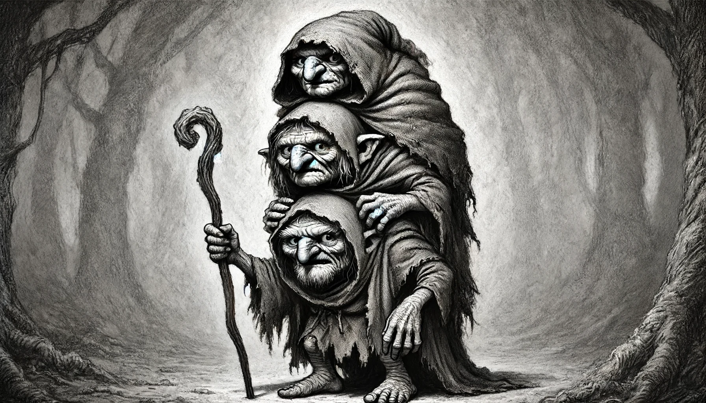
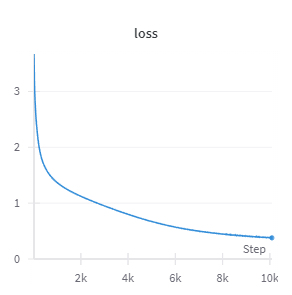
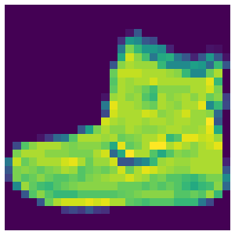
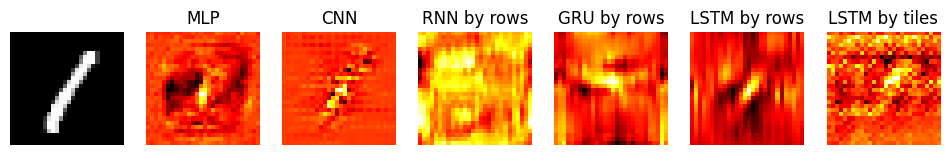
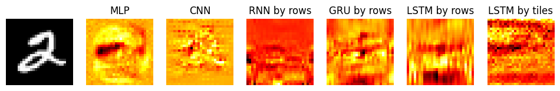
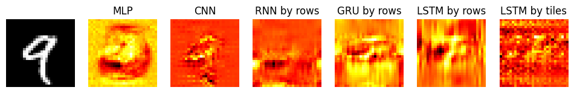
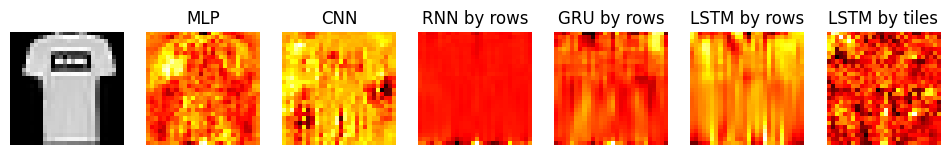
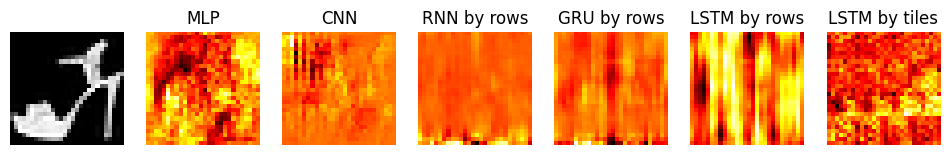

*Beneath a weathered cloak, three crafty goblins stand stacked, masquerading as an ancient wizard. Each goblin, akin to the layers of a Recurrent Neural Network. Every action built upon the input of others, warping the delicate weave of mana. Though seamless from the outside, this clever orchestration of individual parts works in mischievous harmony, each decision a product of collective cunning.*



## The Quest
Look through the archives for ancient magic, and implement the different flavors of recurrent neural networks whose power once reigned supreme and may rise anew to claim their throne.

## Why RNNs?
RNNs arise from the need to handle sequences with variable lengths. By calling the RNN cell sequentially on each of its elements and passing along a compressed representation of the previous state.

## Recurrent Neural Network (RNN)
RNNs are the most basic flavor, and give their name to the family of models. We start with a `memory` initialized to zeros, compute a simple function and pass it around.

```python
class RNN(nn.Module):
    def __init__(self, d_in, d_hidden):
        super().__init__()
        self.d_hidden = d_hidden
        self.i2h = nn.Linear(d_in, d_hidden)
        self.h2h = nn.Linear(d_hidden, d_hidden)

    def forward(self, xs, memory=None, return_memory=False):
        batch, d_context, d_in = xs.shape
        outs = []
        if memory is None: memory = t.zeros(batch, self.d_hidden, device=xs.device)
        for i in range(d_context):
            x = xs[:, i]
            memory = F.tanh(self.i2h(x) + self.h2h(memory))
            outs.append(memory)
        return t.stack(outs, dim=1)
```
## Long short-term memory (LSTM)
LSTMs try to address the shortcomings of RNNs by adding some kind of residual / skip connection to help the gradients flow between stages. We still have to handle the input, the short-term memory `h_prev`, but also a long-term memory `c_prev`.

```python
class LSTMCell(nn.Module):
    def __init__(self, d_in, d_hidden):
        super().__init__()
        self.W_f = nn.Linear(d_in + d_hidden, d_hidden)  # forget gate
        self.W_i = nn.Linear(d_in + d_hidden, d_hidden)  # input gate
        self.W_c = nn.Linear(d_in + d_hidden, d_hidden)  # cell state update
        self.W_o = nn.Linear(d_in + d_hidden, d_hidden)  # output gate

    def forward(self, x, h_prev, c_prev):
        x = t.cat((x, h_prev), dim=1)
        # handle long-term memory `c`
        f_gate = t.sigmoid(self.W_f(x))
        i_gate = t.sigmoid(self.W_i(x))
        c_update = t.tanh(self.W_c(x))
        c_prev = f_gate * c_prev + i_gate * c_update
        # handle short-term memory `h`
        o_gate = t.sigmoid(self.W_o(x))
        h_prev = o_gate * t.tanh(c_prev)
        return h_prev, c_prev
```

We orchestrate the LSTMCell in the same way as for RNN. 

```python
class LSTM(nn.Module):
    def __init__(self, d_in, d_hidden):
        super().__init__()
        self.d_hidden = d_hidden
        self.lstm_cell = LSTMCell(d_in, d_hidden)

    def forward(self, xs, h_prev=None, c_prev=None):
        batch, d_context, d_in = xs.shape
        hs, cs = [], []
        if h_prev is None: h_prev = t.zeros(batch, self.d_hidden, device=xs.device)
        if c_prev is None: c_prev = t.zeros(batch, self.d_hidden, device=xs.device)
        for i in range(d_context):
            x = xs[:, i]
            h_prev, c_prev = self.lstm_cell(x, h_prev, c_prev)
            hs.append(h_prev)
            cs.append(c_prev)
        return t.stack(hs, dim=1), t.stack(cs, dim=1)
```

## Gated Recurrent Unit (GRU)
GRUs are a simplification of LSTMs while retaining most of the performance.

```python
class GRUCell(nn.Module):
    def __init__(self, d_in, d_hidden):
        super().__init__()
        self.W_r = nn.Linear(d_in + d_hidden, d_hidden)  # reset gate
        self.W_z = nn.Linear(d_in + d_hidden, d_hidden)  # update gate
        self.W_h = nn.Linear(d_in + d_hidden, d_hidden)  # hidden state update

    def forward(self, x, h_prev):
        cat = t.cat((x, h_prev), dim=1)
        r_gate = t.sigmoid(self.W_r(cat))
        z_gate = t.sigmoid(self.W_z(cat))
        h_candidate = t.tanh(self.W_h(t.cat((x, r_gate * h_prev), dim=1)))
        h_prev = (1 - z_gate) * h_prev + z_gate * h_candidate
        return h_prev
```

The driving code remains the same.

```python
class GRU(nn.Module):
    def __init__(self, d_in, d_hidden):
        super().__init__()
        self.d_hidden = d_hidden
        self.gru_cell = GRUCell(d_in, d_hidden)

    def forward(self, xs, h_prev=None):
        batch, d_context, d_in = xs.shape
        outs = []
        if h_prev is None: h_prev = t.zeros(batch, self.d_hidden, device=xs.device)
        for i in range(d_context):
            x = xs[:, i]
            h_prev = self.gru_cell(x, h_prev)
            outs.append(h_prev)
        return t.stack(outs, dim=1)
```

## Bonus: Stacked LSTM
Now all of the above can be stacked. To put the *deep* in deep learning. The Cell remains unchanged. Adding more depth to the network will, in principle, let us learn more complex functions.

```python
class StackedLSTM(nn.Module):
    def __init__(self, d_in, d_hidden, d_layers):
        super().__init__()
        self.d_hidden = d_hidden
        self.d_layers = d_layers
        self.lstm_cells = nn.ModuleList([LSTMCell(d_in if l == 0 else d_hidden, d_hidden) for l in range(d_layers)])

    def forward(self, xs, h_prev=None, c_prev=None):
        batch, d_context, d_in = xs.shape
        outs = []
        if h_prev is None: h_prev = t.zeros(self.d_layers, batch, self.d_hidden, device=xs.device)
        if c_prev is None: c_prev = t.zeros(self.d_layers, batch, self.d_hidden, device=xs.device)
        for i in range(d_context):
            x = xs[:, i]
            h_next, c_next = [], []
            for lstm_cell, h, c in zip(self.lstm_cells, h_prev, c_prev):
                h, c = lstm_cell(x, h, c)
                h_next.append(h)
                c_next.append(c)
                x = h
            outs.append(h)
            h_prev = t.stack(h_next)
            c_prev = t.stack(c_next)
        return t.stack(outs, dim=1), h_prev, c_prev
```

## Next Token Prediction: Learn Alice's Adventures in Wonderland
Let's train a character level next token predictor on a classic.

```python
class AliceStackedLSTM(nn.Module):
    def __init__(self, d_vocab, d_hidden, d_layers):
        super().__init__()
        self.embed = nn.Embedding(d_vocab, d_hidden)
        self.stacked_lstm = StackedLSTM(d_hidden, d_hidden, d_layers)
        self.unembed = nn.Linear(d_hidden, d_vocab)
        self.unembed.weight = self.embed.weight

    def forward(self, xs):
        xs = self.embed(xs)
        out, _, _ = self.stacked_lstm(xs)
        return self.unembed(out)
```

Train for a bunch of epochs.



| Epoch | Sample                                                                   |
|-------|--------------------------------------------------------------------------|
| 0     | AMz-((uuqshpggpgppzzSg(zp(gqq(zh((-((ggzq(pz(qgzzS(uh                    |
| 100   | A) asel tho the therad in h the as t icl ooud shand the as tha s         |
| 400   | Alien the the calked a that of the heres all should sayt, and to seen it |
| 3000  | As after her playing again and made all the roof. (she was surprised     |
| 10000 | Alice, and they sawn Alice of the sky-boxed the Queen                    |

### How does the model choose the next token
I made a small widget inspired by the Anthropic papers to look at how the model chooses the next token.

When hovering, we can see:
- the activations of the last layer
- the top 5 predicted tokens
- the influence of preceding tokens, positive in red, negative in blue

(PS: It looks cuter in light-mode)



I can't say that the results are very intuitive to me. Looking at the second word, `l`, `o`, and `o` all encourage `k`, which goes nicely with my idea, but `e` doesn't get much support even though it's a 99% favorite to get picked.

## Image Classification and Saliency Map
RNNs can also be used for classification. First, we tokenize the images; it could be by row, column, in a spiral pattern...

For the demo, I'll use tiles.

```python
def reshape_tile(xs, tile=7):
    batch, c, h, w = xs.shape
    assert h % tile == 0
    assert w % tile == 0
    assert c == 1
    xs = xs.view(batch, h // tile, tile, w // tile, tile)
    xs = xs.permute(0, 1, 3, 2, 4)
    xs = xs.contiguous().view(batch, -1, tile * tile)
    return xs
```



### Compare Different Models: Accuracy and Saliency Map
Training for a few epochs just to get an idea of how capable the models are. The code for all the models is available on [github](https://github.com/peluche/RNN-LSTM-GRU/blob/master/rnn-lstm-gru.ipynb).

For each model we'll compute the accuracy on the test set.

```python
@t.no_grad()
def accuracy(model, dataloader=testloader, reshape=None):
    model.eval()
    assert reshape is not None
    correct, total = 0, 0
    for xs, ys in dataloader:
        xs = reshape(xs.to(device))
        out = model(xs)
        correct += (out.argmax(-1) == ys.to(device)).sum()
        total += len(xs)
    model.train()
    return correct / total
```

As well as a saliency map.

```python
def saliency(model, x, y, accumulate=1, noise=None, reshape=reshape_default):
    model.eval()
    x, y = x.to(device), y.to(device)
    x.requires_grad = True
    x.grad = None
    xs = reshape(x)
    out = model(xs)
    loss = -out[0, y]
    loss.backward()
    return x.grad
```

#### MNIST
All the models' performances are fairly similar.

| Model         | Accuracy |
|---------------|----------|
| MLP           | 0.961    |
| CNN           | 0.988    |
| RNN by rows   | 0.964    |
| GRU by rows   | 0.982    |
| LSTM by rows  | 0.987    |
| LSTM by tiles | 0.966    |

What is interesting is how different the saliency maps look across architectures.





Based on the images, I would have assumed the CNN would significantly outperform everything else, but the GRU and LSTM by rows have similar accuracies.

#### Fashion MNIST
Once again, the accuracies are pretty similar.

| Model         | Accuracy |
|---------------|----------|
| MLP           | 0.883    |
| CNN           | 0.881    |
| RNN by rows   | 0.850    |
| GRU by rows   | 0.881    |
| LSTM by rows  | 0.869    |
| LSTM by tiles | 0.857    |




This time, I would have put my money on the MLP.

## The code
You can get the code at https://github.com/peluche/RNN-LSTM-GRU/blob/master/rnn-lstm-gru.ipynb

## Sources
For nice visualizations of the different RNNs architectures: https://colah.github.io/posts/2015-08-Understanding-LSTMs/
