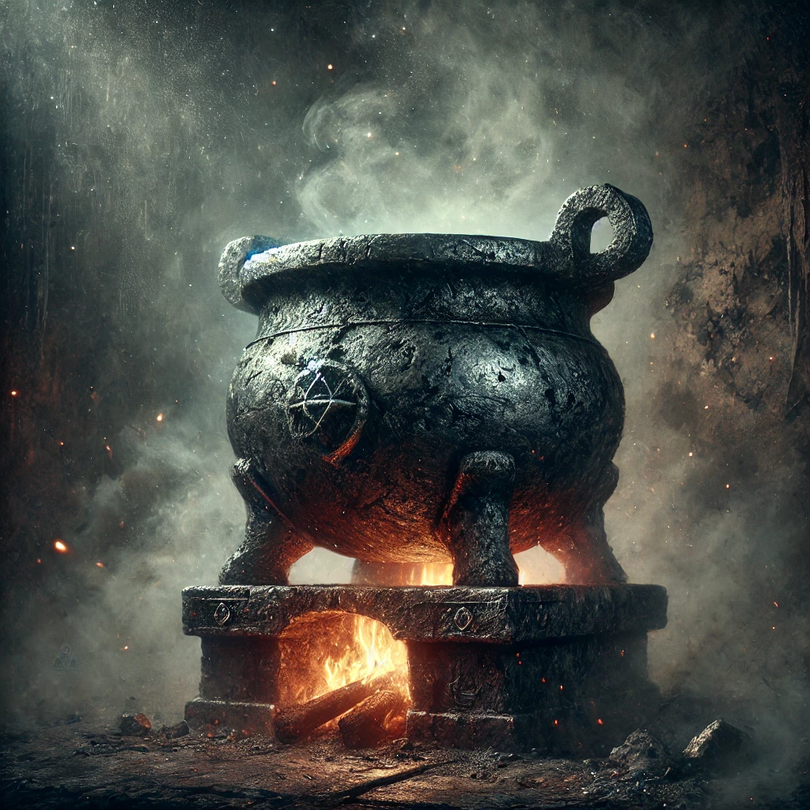

*Beneath the Arcane Academy, the Crucible of the Magi endures—aglow with a roaring fire, this dark iron relic, used to dissect enchanted artifacts into their primal essences, whispers secrets of raw power and hidden truths as it deconstructs, revealing the core components fundamental to spellcraft. Those who wield its power must tread carefully, for the truths it unveils can be as perilous as they are enlightening.*



## The Quest
Harness the power of SVD to compress images and recommend books.

## Why SVD?
SVD is a mathematical tool to deconstruct a matrix of data into its underlying patterns. It allows us to discover hidden regularities in the data. This can be exploited to get rid of redundancies or low level noise and focus on the stronger signal.

## Singular Value Decomposition (SVD)
SVD lets us factor a matrix $A$ into 3 components
$$ A = U \Sigma V^{T}$$
$A$: (m, n) matrix

$U$: (m, m) column matrix

$\Sigma$: (m, n) diagonal matrix

$V^{T}$: (n, n) row matrix

The SVD has many mathematical properties, and is computed using dark magic (iterative algorithms). But for our purpose I mostly care about one property: the columns of $U$, values of $\Sigma$, and rows of $V^{T}$ are sorted by variance (aka. the important patterns go first, and the leftover noise goes last).

```python
# given a cloud of points data, we compute the SVD
u, s, v = torch.svd(data)
pca_data = data @ v
plot_points(data)
plot_points(data, v)
plot_points(pca_data, v.T @ v)
```


Here the vector `v[0]` drawn in black is the principal component as it explains most of the variance of our points (aka. the points are the most spread out in the black diagonal axis). We can use `v` to make a basis change and align the cloud of points with the `x` axis.

## Image Compression
Reusing the same property we can decompose an image into its most important components and discard the leftover to compress it.

```python
h, w, c = img.shape
# reshape the image into a 2d tensor by concatenating the color channel `c` with the width `w`
reshaped = img.reshape(h, w * c)
u, s, v = torch.svd(reshaped)
step = 10 # how many components we want to keep
reconstructed = u[:, :step] @ t.diag(s[:step]) @ v[:, :step].T
reconstructed = reconstructed.view(h, w, c)
```


At step 130 we achieve a file size of only 12% but cover 80% of the variance, and the image looks close to the original.


## Recommender Systems
### SVD
The regularities SVD finds in the data can also be used to make a rudimentary recommender system.

```python
# given a matrix of (users, books) containing ratings from 1-5 and 0 for non-rated
u, s, v = torch.svd(user_book)
r = 100
# given a new user rating a few books
ratings = t.zeros(user_book.shape[1])
ratings[15] = 4
ratings[20] = 5
ratings[30] = 3
ratings[50] = 4
# project the new user into the latent space of v
user_projection = ratings @ v[:, :r]
# predict the other ratings based on the projected user
predictions = user_projection @ v[:, :r].T
```

We compute the similarities between users and books relations, and use them to predict the books a new user would like given the books they already rated. In practice the latent space is not nicely interpretable, but in concept we could imagine that some pattern would emerge around the genres of the book, and the age of the reader, the language of the text...

When presented with a new user we fit it to a reader archetype, if they rated highly fantasy books for young adults in english, when projecting the archetype back into the full list of books, we'll get high scores for other similar books.

### Funk SVD
Now say we have a lot more books, and a lot more users. Computing the SVD becomes prohibitively expensive, even building the `(users, book)` matrix becomes too expensive. Most of the users haven't read most of the books. So the matrix is very sparse, and we could instead represent the relations as a list of triplets of `(user_id, book_id, rating)`.

Simon Funk came up with a solution to compute an approximation of the SVD by ignoring the unrated elements and focusing on only predicting the triplets.

```python
class NaiveFunk(nn.Module):
    def __init__(self, users, books, r=100):
        super().__init__()
        self.user_factors = nn.Parameter(torch.randn(users, r))
        self.book_factors = nn.Parameter(torch.randn(books, r))

    def forward(self, user, book):
        user_vec = self.user_factors[user]
        book_vec = self.book_factors[book]
        ratings = torch.sum(user_vec * book_vec, dim=-1)
        return ratings
    
    @property
    def u(self): return self.user_factors.data
    @property
    def v(self): return self.book_factors.data
```

We train the model only on rated entries:

```python
def train(model, ds, epochs=1000, lr=1e-3, opt=None, batch_size=10000):
    if opt is None: opt = optim.AdamW(model.parameters(), lr=lr, weight_decay=1e-2)
    for epoch in range(epochs):
        for batch_start in range(0, len(ds), batch_size):
            batch = ds[batch_start:batch_start+batch_size]
            user_idx = torch.tensor(batch['user_id'].values, dtype=torch.int, device=device)
            book_idx = torch.tensor(batch['book_id'].values, dtype=torch.int, device=device)
            ratings = torch.tensor(batch['rating'].values, dtype=torch.float32, device=device)
            preds = model(user_idx, book_idx)
            loss = F.mse_loss(preds, ratings)
            opt.zero_grad()
            loss.backward()
            opt.step()
```

One way to evaluate the quality of the recommendation is to take a set of test users we haven't trained on. Mask their top 10 highest rated books and ask the model to predict recommendations based on their other liked books. Use the ratio of overlap between the user favorite-10 and the system top-10 recommendations.


## The code
You can get the code at https://github.com/peluche/SVD

## Sources
- Lectures from Steve Brunton: https://youtu.be/gXbThCXjZFM
- Lectures by Gilbert Strang: https://youtu.be/mBcLRGuAFUk
- Simon Funk explanation of his algorithm: https://sifter.org/simon/journal/20061211.html
