*Daedalus, master craftsman of ancient myths, conceived the Labyrinth: a maze of bewildering complexity. Its winding paths and endless turns, a testament to his genius, were designed to confine the fearsome Minotaur, blurring the line between architectural marvel and cunning trap.*


## The Quest
Train a network on Daedalus work to generate new mazes.

## Autoencoder
An autoencoder is a type of network shaped like an hourglass. We start with an input, and pass it through smaller and smaller layers until reaching the bottleneck point (also refered to as latent space). We then feed the bottleneck to bigger and bigger layer until we reach the original size. And train the network to recronstruct the original input.

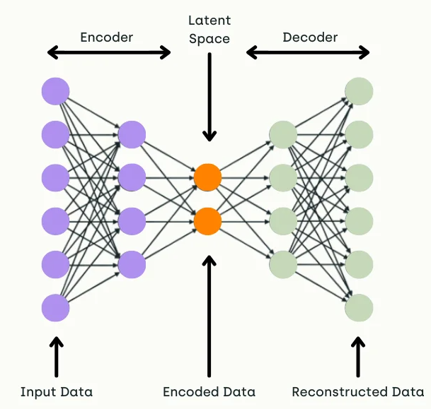

This has several applications:
- we can use the bottleneck as a compressed representation
- the architecture is often used for denoizing
- colorization
- and in our case generation

By tweaking the values of the latent space, the hope is that our second half of the network (the decoder) would re-create a valid output, but somewhat different from the training set.

We'll take a detour through MNIST because it's a canonical example and I want to have a way to evaluate how poorly is the network doing.

```python
class Autoencoder(nn.Module):
    def __init__(self, latent_dims=2, input_dims=28, hidden_dims=512):
        super().__init__()
        self.encoder = nn.Sequential(
            nn.Flatten(start_dim=1),
            nn.Linear(input_dims**2, hidden_dims),
            nn.ReLU(),
            nn.Linear(hidden_dims, latent_dims)
        )
        self.decoder = nn.Sequential(
            nn.Linear(latent_dims, hidden_dims),
            nn.ReLU(),
            nn.Linear(hidden_dims, input_dims**2),
            nn.Sigmoid(),
            nn.Unflatten(1, (1, input_dims, input_dims)),
        )

    def forward(self, x):
        x = self.encoder(x)
        return self.decoder(x)

def train(model, data, epochs=20, lr=3e-4, log_every=3):
    opt = torch.optim.Adam(model.parameters(), lr=lr)
    for epoch in range(epochs):
        for x, _label in data:
            x = x.to(device)
            x_hat = model(x)
            loss = ((x - x_hat)**2).sum()
            opt.zero_grad()
            loss.backward()
            opt.step()
        # visualize progress
        if epoch % log_every == log_every - 1:
            with torch.no_grad():
                img = data.__iter__().__next__()[0][0, :, :, :].to(device)
                res = model(img)
                plot(img, res, block_size=1)

a = Autoencoder(latent_dims=2).to(device)
train(a, data, epochs=40)
```

We train the network at reconstructing numbers, and then look at decoded values from around the origin `(0, 0)` of the 2d latent space:

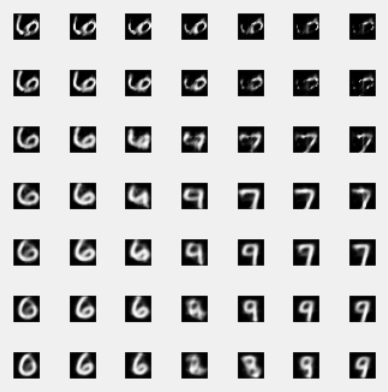

The numbers are not that good, and one of the cause is that the latent space is pretty wide and sparse, so taking a random value inside of it, is unlikely to lineup with a valid value that can be decompressed cleanly.

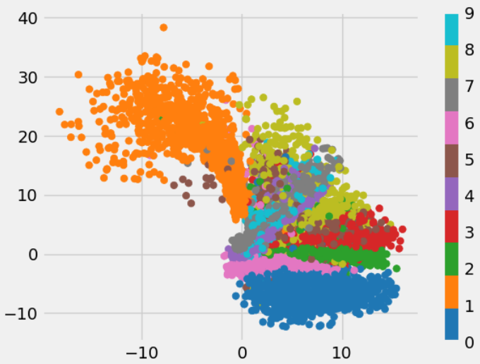

## Variational Autoencoders (VAE)
Variational Autoencoders keep the same hourglass architecture of the autoencoders. With some extra magic in the middle to improve the density / compactness of the latent space.

The trick is to instead of generating a latent vector in the bottleneck directly, it generates a standard deviation and mean, and sample a value from the normal with these parameters. By adding a component to the loss to fit said mean and std to be a normal Gaussian (`mean = 0`, `std = 1`) we encourage the latent space to be concentrated around the origin `(0, 0)` and have a spread of `[-3 to 3]`.

This is meant to improve the likelihood to sample a valid value that would decompress well into a valid image.

```python
class VAE(nn.Module):
    '''Variational autoencoder'''
    def __init__(self, latent_dims=2, input_dims=28, hidden_dims=512):
        super().__init__()
        self.encoder = nn.Sequential(
            nn.Flatten(start_dim=1),
            nn.Linear(input_dims**2, hidden_dims),
            nn.ReLU(),
            nn.Linear(hidden_dims, 2 * latent_dims)
        )
        self.decoder = nn.Sequential(
            nn.Linear(latent_dims, hidden_dims),
            nn.ReLU(),
            nn.Linear(hidden_dims, input_dims**2),
            nn.Sigmoid(),
            nn.Unflatten(1, (1, input_dims, input_dims)),
        )
        self.kl = 0

    def sample(self, x):
        mu, log_var = x.chunk(2, dim=1)
        sigma = torch.exp(log_var)
        z = mu + sigma * torch.randn_like(sigma)
        self.kl = 0.5 * (sigma**2 + mu**2 - torch.log(sigma) - 1).sum()
        return z

    def forward(self, x):
        x = self.encoder(x)
        z = self.sample(x)
        return self.decoder(z)

def train(model, data, epochs=20, lr=3e-4, log_every=3):
    opt = torch.optim.Adam(model.parameters(), lr=lr)
    for epoch in range(epochs):
        for x, _label in data:
            x = x.to(device)
            x_hat = model(x)
            loss = ((x - x_hat)**2).sum() + model.kl
            opt.zero_grad()
            loss.backward()
            opt.step()
        # visualize progress
        if epoch % log_every == log_every - 1:
            with torch.no_grad():
                img = data.__iter__().__next__()[0][0, :, :, :].to(device)
                res = model(img)
                plot(img, res, block_size=1)

vae = VAE(latent_dims=2).to(device)
train(vae, data, epochs=40)
```

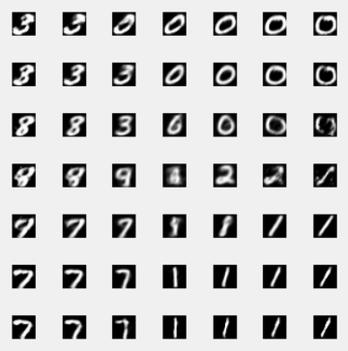

The numbers are a bit better and the latent space is a lot more compact:

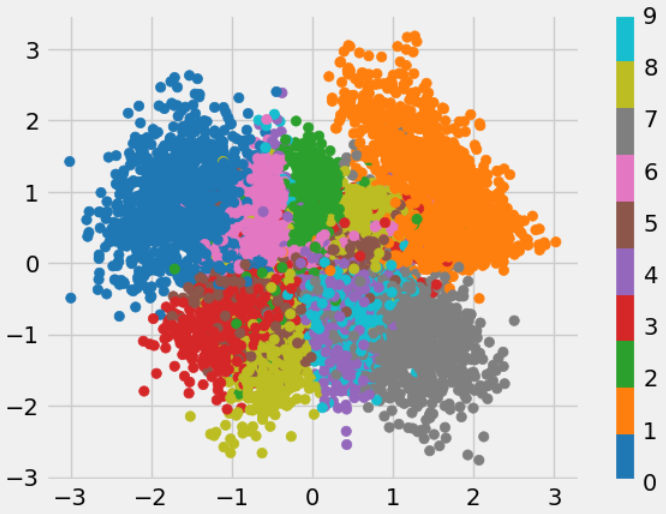

## Improve training
Adding the normal sampling step in the latent space add noise to the training. Instead of optimizing for reconstruction, we now optimize for a mix of both reconstruction and fitting a unit Gaussian. Which dilute our efforts. One trick that was proposed to improve training is to start training with no Gaussian regularization, and slowly increase the importance of the normalization.

### Monotonic Annealing
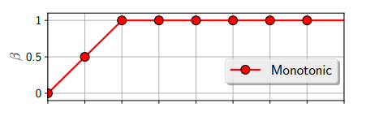

```python
def annealing_train(model, data, epochs=20, lr=3e-4, log_every=3):
    opt = torch.optim.Adam(model.parameters(), lr=lr)
    for epoch in range(epochs):
        annealing = min(epoch, epochs // 2) / (epochs // 2)
        for x, _label in data:
            x = x.to(device)
            x_hat = model(x)
            loss = ((x - x_hat)**2).sum() + model.kl * annealing
            opt.zero_grad()
            loss.backward()
            opt.step()
        # visualize progress
        if epoch % log_every == log_every - 1:
            with torch.no_grad():
                img = data.__iter__().__next__()[0][0, :, :, :].to(device)
                res = model(img)
                plot(img, res, block_size=1)
```

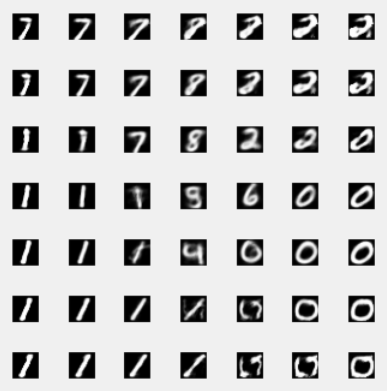
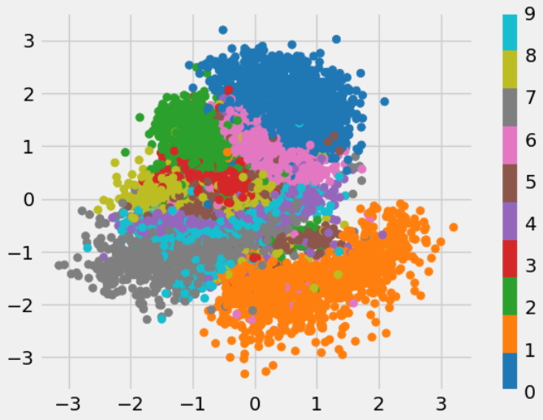

### Cyclical Annealing
Another improvement proposed was to do cycles of training:

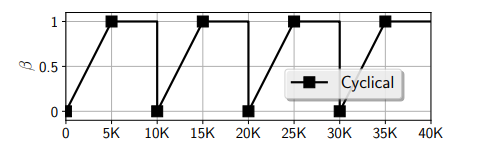

```python
def cyclic_annealing_train(model, data, epochs=20, lr=3e-4, log=True, log_every=3):
    opt = torch.optim.Adam(model.parameters(), lr=lr)
    n_batch = len(data.__iter__())
    for epoch in range(epochs):
        for i, (x, _label) in enumerate(data):
            annealing = min(i, n_batch // 2) / (n_batch // 2)
            x = x.to(device)
            x_hat = model(x)
            loss = ((x - x_hat)**2).sum() + model.kl * annealing
            opt.zero_grad()
            loss.backward()
            opt.step()
        # visualize progress
        if log and epoch % log_every == log_every - 1:
            with torch.no_grad():
                img = data.__iter__().__next__()[0][0, :, :, :].to(device)
                res = model(img)
                plot(img, res, block_size=1)
```

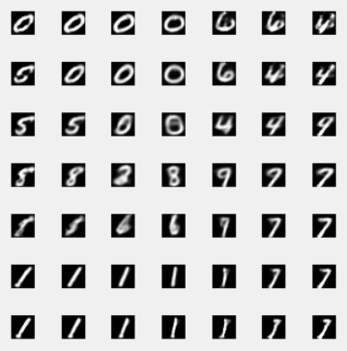
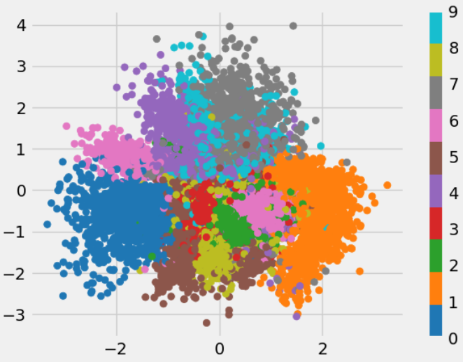

## Generate Mazes
Instead of training on MNIST. We reuse the same code on mazes.

### Get a training set
We generate maze using a known algorithm

```python
def make_maze(width):
    maze = torch.zeros((width, width))
    def add_exit(maze):
        choices = (maze == 1).nonzero().tolist()
        furthest = max(choices, key=lambda x: x[0] + x[1])
        maze[furthest[0], furthest[1]] = -1

    def rec(x, y):
        while True:
            pairs = []
            for move in MOVES:
                dx, dy = move
                nx, ny = x + dx, y + dy
                nnx, nny = nx + dx, ny + dy
                if 0 <= nnx < width and 0 <= nny < width and maze[nnx, nny] == 0 and maze[nx, ny] == 0:
                    pairs.append((nx, ny, nnx, nny))
            random.shuffle(pairs)
            if not pairs: break
            nx, ny, nnx, nny = pairs[0]
            maze[nx, ny], maze[nnx, nny] = 1, 1
            rec(nnx, nny)

    maze[0, 0] = 1
    rec(0, 0)
    add_exit(maze)
    return maze
```

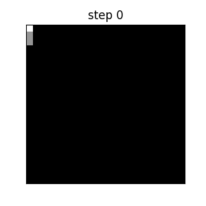

Serve the examples as a torch dataset.

```python
dataset_size = 1280
many_mazes = torch.stack([make_maze(28).unsqueeze(0) for _ in range(dataset_size)])
labels = torch.zeros_like(many_mazes)
maze_data = torch.utils.data.DataLoader(
    torch.utils.data.TensorDataset(many_mazes, labels),
    batch_size=128,
    shuffle=True)
```

Train and sample from the latent space.

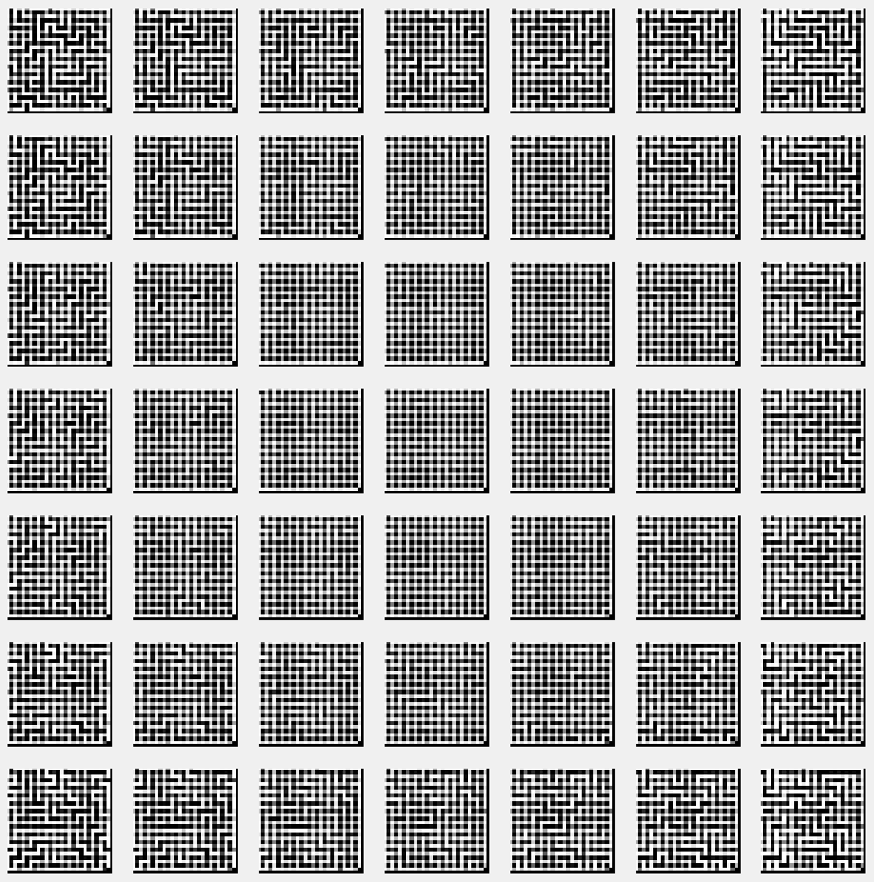

I left this one because we can see that the middle is mostly a grid, and the extreme start to have structures. To get something usable we clip the values of the wall to 0 and 1.

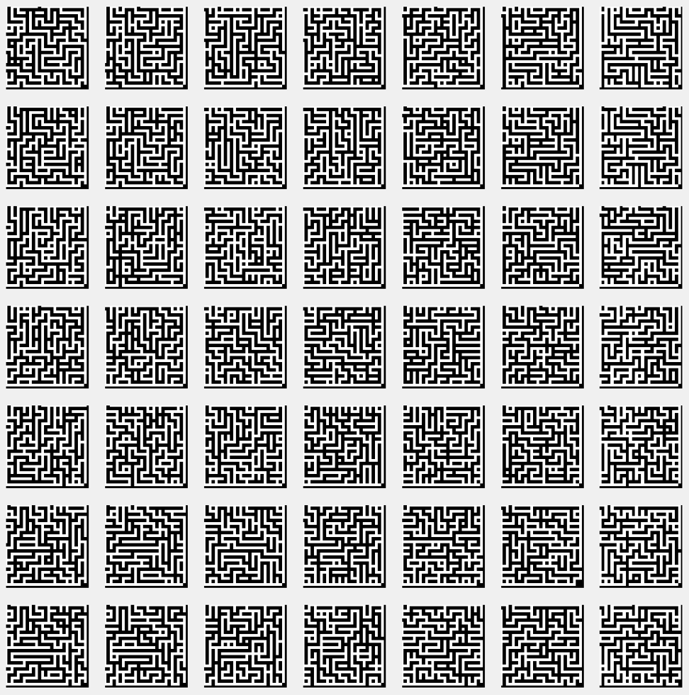

## The code
You can get the code at https://github.com/peluche/daedalus

## Sources
In the journey to reproduce daedalus work I had to decipher many manuscripts including:
- autoencoder: https://arxiv.org/pdf/2003.05991.pdf
- VAE: https://arxiv.org/pdf/1312.6114.pdf
- Cyclical Annealing: https://arxiv.org/pdf/1903.10145.pdf
- https://avandekleut.github.io/vae/
- https://www.microsoft.com/en-us/research/blog/less-pain-more-gain-a-simple-method-for-vae-training-with-less-of-that-kl-vanishing-agony/

And a special thanks to [John Isak Texas Falk](https://isakfalk.com/) who's attending the [Recurse Center](https://www.recurse.com/scout/click?t=dcdcd5fced9bfab4a02b4dd6bb05199e) at the same time as me and was kind enough to walk me through some of the mistakes that were bloking me in the Sampling step of VAEs.
