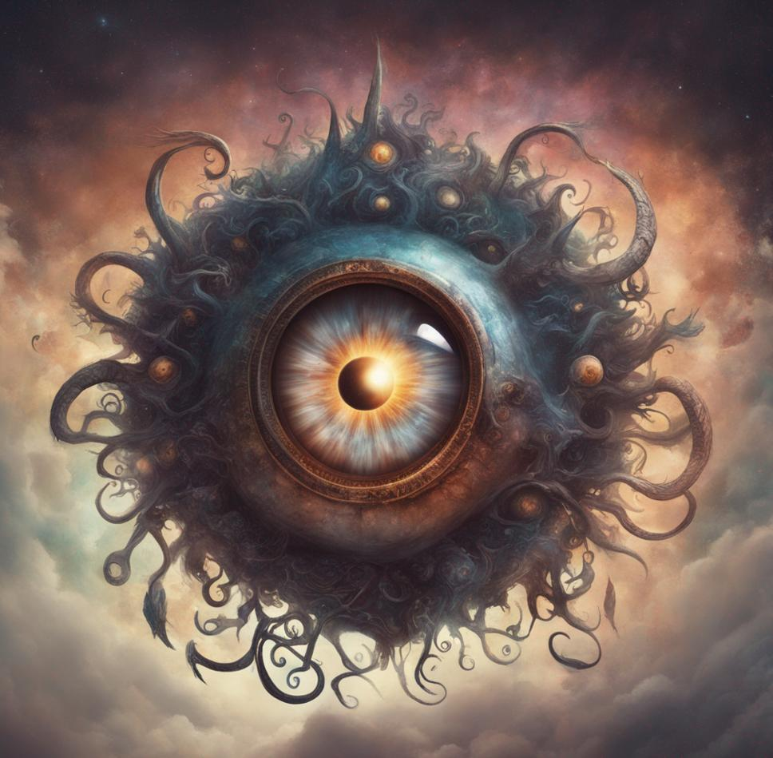
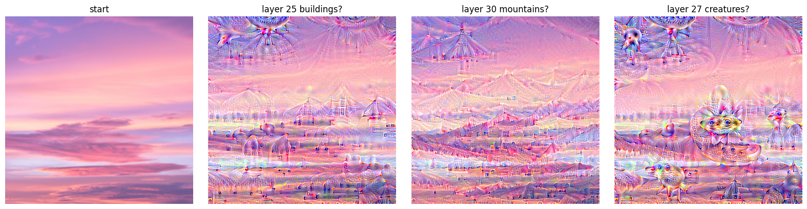
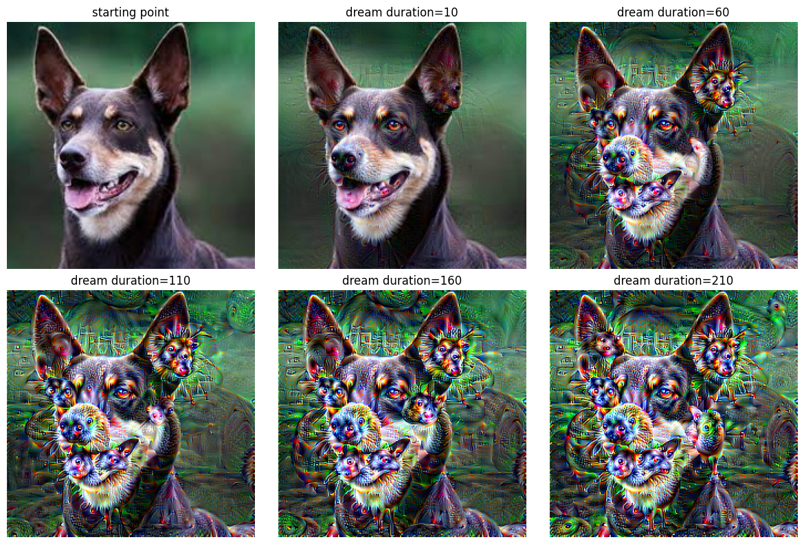
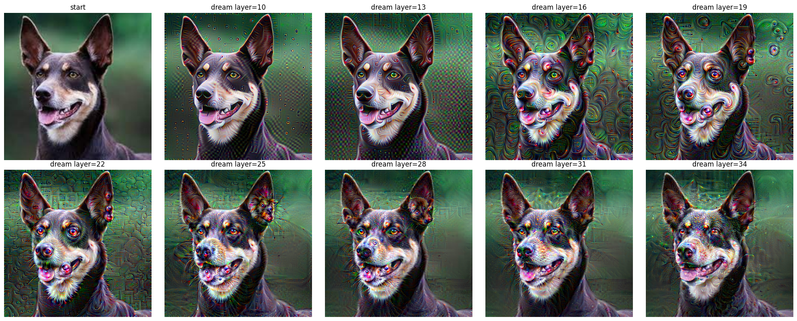
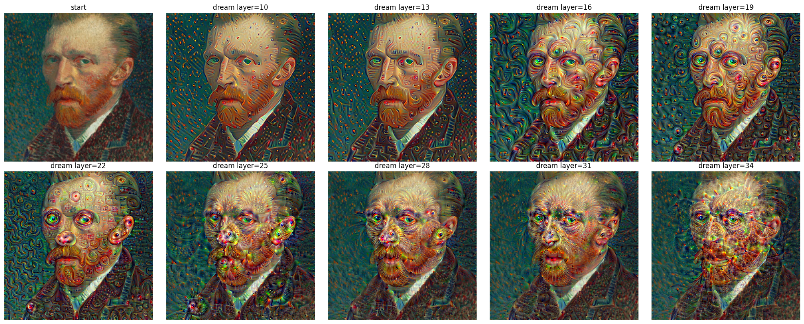
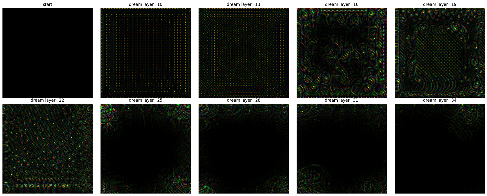
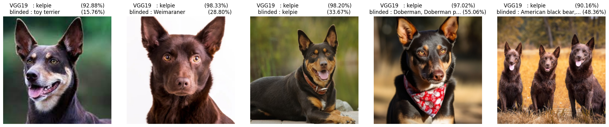

*A Beholder awakens. Its myriad eyes, each a facet of mechanistic insight, gaze upon the intricate layers of information, revealing hidden patterns in the dreams of code. In the tapestry of deepdream, the Beholder becomes the guardian of interpretability, its central eye illuminating the enigmatic connections woven within the digital labyrinth.*



## The Quest
Produce deepdreams from an image classifier. Try to identify specific features in the network, and alter them to blind the network.

## Deepdream
Deepdream is fairly similar to what we used to fool an image classifier. Instead of backpropagating to the original image to minimize the loss for a malicious label. We backpropagate to the original image with the intention to maximize some activation layer in the middle of the network. This is called `gradient ascent`.


### Hook into the image classifier
First we need to hook into the classifier to get access to the activation values of the network

```python
def hook(layer, k, mem=None):
    if mem is None: mem = {}
    def f(module, input, output):
        mem[k] = output
    layer.register_forward_hook(f)
    return mem

def hooked(model):
    m = copy.deepcopy(model).to(device)
    mem = {}
    for layer in range(37):
        mem = hook(m.features[layer], layer, mem=mem)
    return mem, m
```

### Dream
By performing gradient ascent on any layer we amplify the input pixels that would make this layer more active.

```python
def shallowdream(start, layer=35, channel=None, m=vgg_hooked, mem=vgg_mem, learning_rate=0.01, epochs=30):
    start = copy.deepcopy(start.detach())
    # move to device
    dream = start.to(device).requires_grad_()
    m = m.to(device)

    for _ in tqdm(range(epochs)):
        m(dream)
        loss = mem[layer].norm() if channel is None else mem[layer][:, channel, :, :].norm()
        dream.grad = None
        loss.backward()
        dream.data = torch.clip((dream + dream.grad * learning_rate), 0., 1.).data # jumping through hoops to please pytorch
    return drea
```

Now we just have to choose a layer and let the model dream


In this example we can see that earlier layers produce simple features, and the deeper we probe into the network the more complex patterns emerge.

To me some of the layers seem to have meaning (but it might just be an illusion spell):
- 25 looks like buildings, human cronstructions
- 30 like mountains
- and 27 like creatures



We can also choose a given layer and just dream deeper and deeper



And a few more samples for different starting points





## Mechanistic interpretability
Our secondary goal is to identify channels in each layers that are particulary ketering to Kelpie dogs.

### Identify channels
We can feed a bunch of pictures of kelpies and look at the channels that are the most activated and shared between all kelpies.

```python
def save_activations(start, m=vgg_hooked, mem=vgg_mem):
    # move to device
    dream = start.to(device).requires_grad_()
    m = m.to(device)
    # run the model
    m(dream)
    # make a copy of the activations
    activations = {k: copy.deepcopy(output.detach()) for k, output in mem.items()}
    return activations

# compute the top n channels with the highest norm
def topn(activation, n, threshold):
  channels = activation.shape[1]
  top = sorted(zip(activation.view(channels, -1).norm(dim=1), range(channels)), reverse=True)[:n]
  return [idx for norm, idx in top if norm > threshold]

def topn_activations(activations, n=10, threshold=0):
  return {k: topn(activation, n=n, threshold=threshold) for k, activation in activations.items()}

def count_topn(all_topn):
  counts = defaultdict(Counter)
  for topn in all_topn:
    for layer, top in topn.items():
      counts[layer].update(top)
  return counts

all_activations = [save_activations(kelpie) for kelpie in kelpies]
all_topn = [topn_activations(activations) for activations in all_activations]
counts = count_topn(all_topn)
```

Take a look at the features:


### Blind the network
Now lets disable the channels we identified and see how the classifier behaves.

```python
def blinder(counts, model, min_layer=20, most_common=5, threshold=4):
  # nuke a channel
  def nuke(layer, channel):
      def f(module, input, output):
          output[:, channel, :, :] = 0.
      layer.register_forward_hook(f)

  m = copy.deepcopy(model).to(device)
  for layer, count in counts.items():
    # lower layers are basic features like edges, so it doesn't make sense to nuke them
    if layer < min_layer: continue
    for channel, occurences in count.most_common(most_common):
      if occurences < threshold: break
      nuke(m.features[layer], channel)
  return m

vgg_blind = blinder(counts, vgg)

@torch.no_grad()
def evaluate_blinder(img):
    res = []
    models = [
        ('VGG19', vgg.eval()),
        ('blinded', vgg_blind.eval()),
    ]
    for name, model in models:
        label, confidence = classify(img, model)
        if len(label) > 20: label = label[:20] + '...'
        res.append(f'{name:8}: {label:23} ({confidence*100:.2f}%)')
    return '\n'.join(res)
```




The third picture still register as kelpie, but everything else is gone, and the control still match. I'm ok with that, even a blind chicken finds a grain once in a while ;)

## The code
You can get the code at https://github.com/peluche/deepdream
