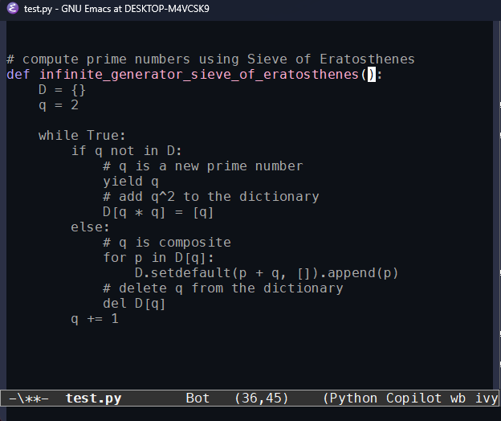

## Setup Emacs (for Windows)
I needed to setup emacs on windows for the first time. Here are my steps:
- Download it from GNU http://ftp.gnu.org/gnu/emacs/windows/emacs-29/emacs-29.1.zip
- Extract it to: `C:\emacs-29.1`
- Navigate to: `C:\emacs-29.1\bin\runemacs.exe` > `right-click` > `Show more options` > `Pin to taskbar`

This gives us a basic working emacs but for some reason the font seemed super choppy so I went and [downloaded Menlo](https://www.cufonfonts.com/font/menlo) for a bit more of an OS X feel. In Emacs:
- `Options` > `Set default font` > `Menlo`
- `Options` > `Save options`

You'll get one of these in your `.emacs` config:
```cl
(custom-set-faces
 ;; custom-set-faces was added by Custom.
 ;; If you edit it by hand, you could mess it up, so be careful.
 ;; Your init file should contain only one such instance.
 ;; If there is more than one, they won't work right.
 '(default ((t (:family "Menlo" :foundry "outline" :slant normal :weight bold :height 120 :width expanded)))))
```

Did a bunch of other setup, using a slightly touched version of `modus-vivendi`. Add my comfort packages, but at this point your tastes probably vary from mine. If you want to get my config as is it's available on GitHub: https://github.com/peluche/dotfiles/blob/master/.emacs.

## Copilot for Emacs
The Copilot plugin I'll be using https://github.com/zerolfx/copilot.el is based on the Neovim plugin. Which in turn works by extracting JS files from the VSCode plugin and running them localy. As a result we need NodeJs on the machine so download and run https://nodejs.org/en/download.

At the time of writing the plugin is not on ELPA/MELPA so we endup with something like

```cl
;; package manager
;; ---------------
(require 'package)
(require 'use-package)
(require 'quelpa)
(require 'quelpa-use-package)
(add-to-list 'package-archives
             '("melpa" . "https://melpa.org/packages/") t)

;; Copilot config
(use-package copilot
             :quelpa (copilot :fetcher github
			      :repo "zerolfx/copilot.el"
			      :branch "main"
			      :files ("dist" "*.el"))
	     :config (progn
		       (define-key copilot-mode-map (kbd "C-S-<return>")
				   #'copilot-accept-completion)
		       (define-key copilot-mode-map (kbd "C-S-<right>")
				   #'copilot-accept-completion-by-word)
		       (define-key copilot-mode-map (kbd "C-S-<down>")
				   #'copilot-accept-completion-by-line)
		       (define-key copilot-mode-map (kbd "C-S-<up>")
				   #'copilot-next-completion)
		       (define-key copilot-mode-map (kbd "C-S-<left>")
				   #'copilot-previous-completion))
	     :init (global-copilot-mode))
```

Run a on-time auth with `M-x copilot-login`.

For the shortcut I deviated a bit from what everyone else seemed to use `C-M-<direction>` and went with `C-S-<direction>` because (1) the `C-M-..` prefix is already used for cursor movement for me. And (2) on a Windows keyboard the Meta key is shifted on slot to the right compared to a Mac and it messes with my muscle memory.

TL;DR: Paste the blob in your `.emacs`. During file editing when some grey text appear press `Control Shift Enter` to accept it.

Note: The grey text gets a bit smarter if you write a comment first to give it inspiration.



## Jupyter
Here's the sad news. As far as I can tell there is no good solution to write Jupyter notebooks from Emacs. The builtin browser [Eww](https://www.gnu.org/software/emacs/manual/html_mono/eww.html) doesn't handle JS and CSS gracefully so the web interface is unusable. There are some effort to [use IPython kernels from Emacs](https://github.com/emacs-jupyter/jupyter) and replace the Markdown with Org-mode but it's too invasive for my taste. And one person articulated a Chrome with Emacs to [edit single notebook cells](https://emacsconf.org/2022/talks/jupyter/).

So after bashing my head for a day I endup in a suboptimal local maximum. VSCode has a great Jupyter plugin, a great Copilot plugin, and a bunch of not quite Emacs 😔 keybindings. But it beats editing code in a web browser.


