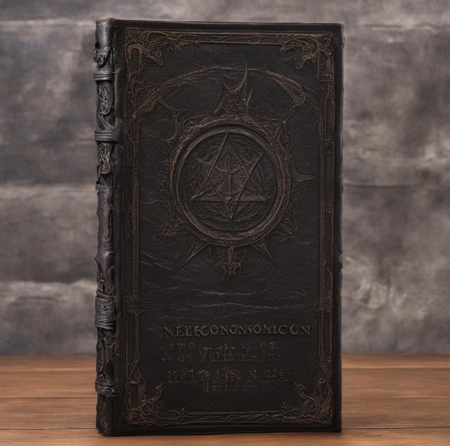

This is the first post going off road for our own little adventure and not following an online course. Today's quest will consist of ~~slaying a dragon~~ building an intuition for embeddings.

## The Quest
The original idea was to try to reproduce the word arithmetic examples from Google's Word2Vec demo: `King - Man + Woman = Queen` and `Paris - France + Italy = Rome`.

(Spoiler alert) it turned out to be more of an experiment on how to create/handle/visualize word embeddings. Even using `Gensim.word2vec` or `BERT` with the google-news pre-trained weights or the ones from huggingface I couldn't get to the same results as the original demo.

## Embeddings Necronomicon



### What are Embeddings
Neural network do not deal with words, they only do algebra. So you can't feed them `'king'`, the solution is to encode king as token (aka. a number, e.g. `42`), one-hot encode it `[0, ... , 0, 1, 0, ..., 0]` as a vector and feed it to the network.

For the sake of this explanation let's assume a naive tokenizer `corpus.split()` where each word has it's own token. It means that your network input layer is the size of your vocabulary and carry a single information: what word is it.

For english we can expect ~200k words (a lot more if we allow uppercase). That's a large numbers of wasted zeros in your one-hot encoded vector. So the first thing we do in the network is to convert it into embeddings. Embeddings is also a vector but typically much smaller (e.g BERT embeddings layer is 768-dimensional) and each number of the vector can be interpreted as a coordinate in an N-dimensional space.

### Skip-Gram
There are 2 commons approch for training an embeddings layer:
- Continuous Bag of Words (CBOW) aka. given a set of context word guess the middle word
- Skip-Gram aka. given a word guess the surrounding context words around it

I went with Skip-Gram model, so it looks like:

```
given a training text: 'kings wear crowns of jewels'
and a context_size: 2
---------------+------------------------+----------------------
given the word | guess the left context | and the right context
---------------+------------------------+----------------------
'kings'       -> [                        'wear',     'crown']
'wear'        -> ['kings',                'crowns',   'of']
'crowns'      -> ['kings', 'wear',        'of',       'jewels']
'of'          -> ['wear', 'crowns',       'jewels']
'jewels'      -> ['crowns', 'of']
```

### Compare Embeddings
After training the network, embeddings present in similar context will move in space close to each other. So we can find words related with each other by searching for the geometrically closest embeddings from them.

The 2 most commonly used distance metrics:
- Euclidean distance (the one human think about when we say 2 things are 10cm appart)
- Cosine distance mesuring the angular distance between 2 N-dimensional embeddings

Let's compare the closest words to `'pink'` for the trained model vs an untrained model
```python
def cosine_dist(a, b):
    return 1 - torch.nn.functional.cosine_similarity(a, b, dim=0)
    
word = 'pink'
# load the model we trained earlier
trained_model = LM()
trained_model.load_state_dict(torch.load('skip-gram.pt'))
tm = trained_model.to(device)
# compared to an untrained one
untrained_model = LM()
um = untrained_model.to(device)

for mm, label in [(tm, 'trained'), (um, 'untrained')]:
    print(f'--- {label} ---')
    emb_word = get_embedding(word, m=mm)
    matches = []
    for w in words_i_want_to_learn:
        if cs[w] < 100:
            continue
        emb_w = get_embedding(w, m=mm)
        d = cosine_dist(emb_word, emb_w)
        matches.append((d, w))
```

```
|---------------------+---------------------|
| trained             | untrained           |
|----------+----------+----------+----------|
| distance | neighbor | distance | neighbor |
|----------+----------+----------+----------|
| 0.0000   | pink     | 0.0000   | pink     |
| 0.6131   | purple   |	0.7887   | prince   |
| 0.6833   | blue     |	0.8442   | king     |
| 0.6907   | yellow   |	0.8538   | chicken  |
| 0.7311   | orange   |	0.8963   | bird     |
| 0.7318   | green    |	0.8980   | lord     |
| 0.8189   | princess |	0.9089   | cow      |
| 0.8519   | red      |	0.9399   | woman    |
| 0.8530   | fish     |	0.9539   | banana   |
```

if we squint really hard at a low PCA (more on that later) representation of the embeddings we can almost see what feature represent color and which one represent monarchy. 

```python
words = ['pink', 'blue', 'yellow', 'king', 'prince', 'duke']
embedding_matrix = torch.stack([get_embedding(w).cpu().detach() for w in words])
pca = PCA(n_components=len(words) - 1)
principal_components = pca.fit_transform(embedding_matrix)

plt.figure(figsize=(10, 4))
plt.imshow(principal_components, cmap='viridis', aspect='auto')
plt.tight_layout()
```


or in 2d (note that we lose one data point because at such low dimensionality `'pink'` and `'yellow'` have the same embedding values:


### Word Arithmetic
For the word arithmetic I experimented with my model, BERT, and Gensim trained on google-news with very marginal success

#### Gensim Word2Vec

```python
from gensim.models import Word2Vec
import gensim.downloader

glove_vectors = gensim.downloader.load('word2vec-google-news-300') # 1.6 GB
e = glove_vectors['paris'] - glove_vectors['france'] + glove_vectors['germany']
glove_vectors.similar_by_vector(e, topn=10)
```

```
('paris', 0.7316325902938843),
 ('germany', 0.6952009797096252),
 ('berlin', 0.48383620381355286),
 ('german', 0.4694601595401764),
 ('lindsay_lohan', 0.4535733461380005),
 ('switzerland', 0.4468131363391876),
 ('heidi', 0.44448140263557434),
 ('lil_kim', 0.43990591168403625),
 ('las_vegas', 0.43985921144485474),
 ('russia', 0.4398398697376251)]
```

#### BERT

```python
from transformers import BertModel, BertTokenizer

# Load pre-trained model and tokenizer
model_name = 'bert-base-uncased'
tokenizer = BertTokenizer.from_pretrained(model_name)
model = BertModel.from_pretrained(model_name)

def get_bert_embedding(word):
    tokens = tokenizer(word, return_tensors='pt')
    token_id = tokens['input_ids'][0][1].item()
    embeddings_layer = model.get_input_embeddings()
    return embeddings_layer(torch.tensor([[token_id]])).view(-1)

bw2e = {w: get_bert_embedding(w) for w in words_i_want_to_learn}
emb_word = bw2e['king'] - bw2e['man'] + bw2e['woman']
matches = []
for w in words_i_want_to_learn:
    emb_w = bw2e[w]
    d = cosine_dist(emb_word, emb_w)
    matches.append((d, w))
```

```
0.2630 king
0.3531 queen
0.5115 woman
0.5248 princess
0.5540 female
0.5956 prince
0.6266 lady
0.6393 duke
0.6689 lord
0.7145 bird
```

## PCA
### What ?
*Principal Component Analysis is a mathematical technique that extracts dominant patterns from a dataset by transforming the original variables into a set of linearly uncorrelated components.*

For embeddings we can use it to shuffle the data so that dimension 1 is more significant than dimension 2, and dim2 than dim3 ...

Here have a look at my network embedding layer for a few words


And after PCA


Notice how the colors get more and more washed toward the right, it's because the PC are ordered by variance.

### Why ?
It can be used to cut off dimensions while losing minimal variance, or cutting many dimensions (and losing a lot of the variance) but making it possible to graph the data.


### How ?



## The code
You can get the code at [https://github.com/peluche/embeddings_necronomicon](https://github.com/peluche/embeddings_necronomicon).

### Sources
No data was harmed in the making of this necronomicon entry but many sources of inspirations have been used, some of my reading but probably not an exhaustive list include:
- https://medium.com/@josua.krause/dot-product-is-a-bad-distance-function-aff7667da6cc
- https://medium.com/analytics-vidhya/why-is-scaling-required-in-knn-and-k-means-8129e4d88ed7
- https://jaykmody.com/blog/distance-matrices-with-numpy/
- https://numerics.mathdotnet.com/Distance
- https://youtu.be/ISPId9Lhc1g
- https://jalammar.github.io/illustrated-word2vec/
- https://towardsdatascience.com/meme-search-using-pretrained-word2vec-9f8df0a1ade3
- https://en.wikipedia.org/wiki/Word2vec
- https://jaketae.github.io/study/word2vec/
- http://mccormickml.com/2017/01/11/word2vec-tutorial-part-2-negative-sampling/
- http://josecamachocollados.com/book_embNLP_draft.pdf
- https://youtu.be/HMOI_lkzW08
- https://youtu.be/FgakZw6K1QQ
- https://youtu.be/oRvgq966yZg
- https://youtu.be/h6MCf89GqCM
- https://youtu.be/TJdH6rPA-TI
