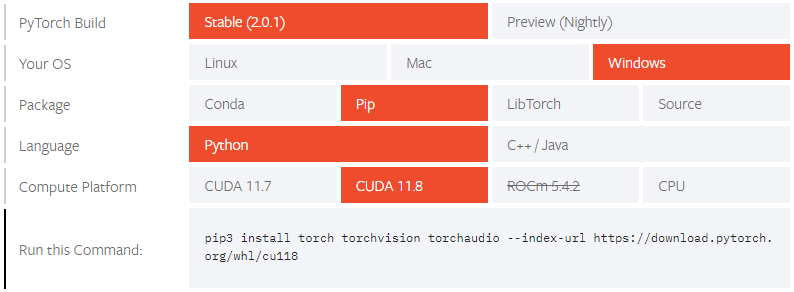
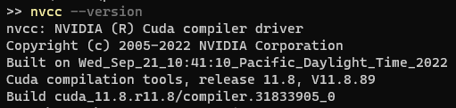

Let's get a place to run code on the GPU (on Windows, don't judge me, it's where my GPU lives). I'm going to setup:
- [Python](https://www.python.org/downloads/)
- [Jupyter](https://jupyter.org/install) 
- [PyTorch](https://pytorch.org/get-started/locally/) with [CUDA](https://developer.nvidia.com/cuda-toolkit-archive)

Download and install Python: https://www.python.org/downloads/

For some reason my Python didn't come with pip so I also ran

```sh
python -m ensurepip
python -m pip install --upgrade pip
```

For [Jupyter](https://jupyter.org/install) I'm also going through pip. Installing everything globally. I'll use `venv` later for project specific dependencies:

```sh
python -m pip install jupyterlab
# or
python -m pip install notebook

# then try it by running
jupyter lab
# or
jupyter notebook
```

Now, to get GPU acceleration. Install CUDA, head up to PyTorch https://pytorch.org/get-started/locally/ and download a supported version of CUDA



Download the `11.8.0` version of CUDA: https://developer.nvidia.com/cuda-toolkit-archive. Press next, next, next and skip installing Visual Studio. We can confirm that it worked by running `nvcc --version`.



And install PyTorch with CUDA support

```sh
python -m pip install torch torchvision torchaudio --index-url https://download.pytorch.org/whl/cu118
```

Double check it worked by running in a notebook

```py
import torch

print(f'{torch.cuda.is_available()=}')
print(f'{torch.cuda.device_count()=}')
print(f'{torch.cuda.get_device_name()=}')
```

```
torch.cuda.is_available()=True
torch.cuda.device_count()=1
torch.cuda.get_device_name()='NVIDIA GeForce RTX 3080'
```
