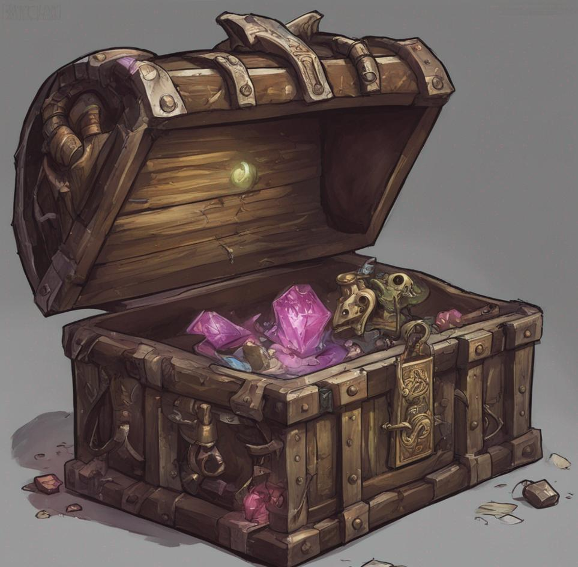
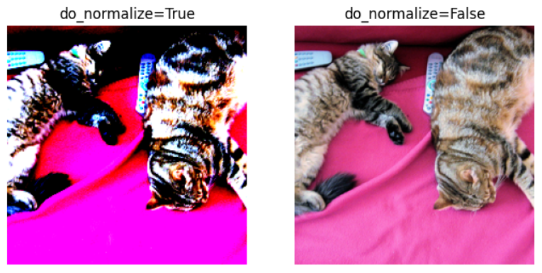
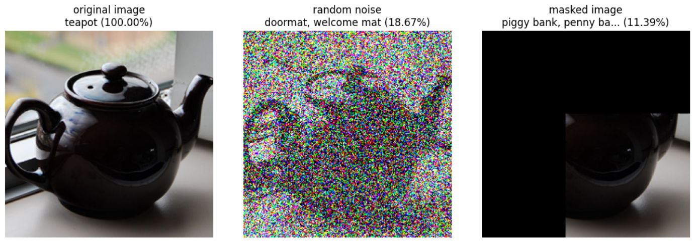
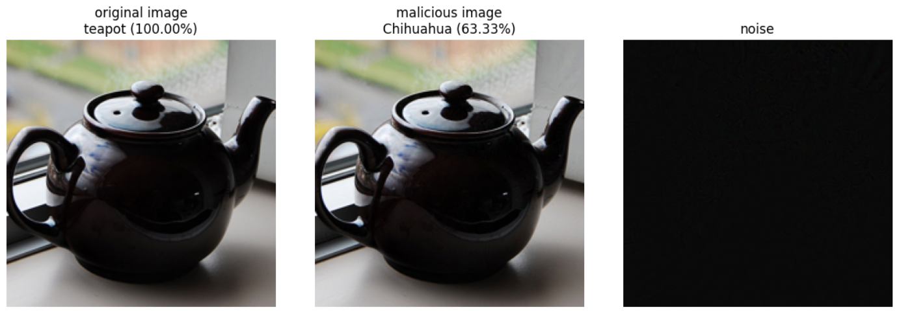
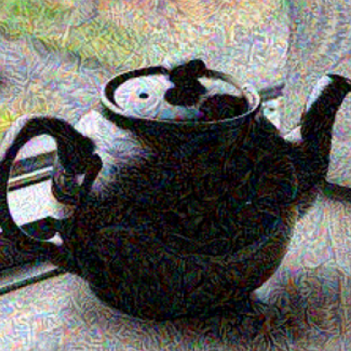

*In the dimly lit corridors of the ancient dungeon, where shadows dance and secrets lie in wait, an eerie silence is suddenly shattered by the faint creaking of wooden planks. Unbeknownst to the adventurers, a malevolent presence lurks among the mundane, adopting the guise of an innocuous chest or treasure trove. Beware the mimic, a shape-shifting aberration that hungers for the thrill of deception and the taste of unsuspecting intruders.*



## The Quest
Crafting a [d&d mimic](https://en.wikipedia.org/wiki/Mimic_(Dungeons_%26_Dragons)). Fool a CNN image classifier into thinking that a picture of a teapot is a chihuahua.

## Image Classifier
Our target will be [ResNet-50](https://huggingface.co/microsoft/resnet-50) pre-trained on [Imagenet-1k](https://huggingface.co/datasets/imagenet-1k).

Pull a pre-trained model from huggingface:

```python
processor = AutoImageProcessor.from_pretrained("microsoft/resnet-50")
model = ResNetForImageClassification.from_pretrained("microsoft/resnet-50")
```

For this post we'll disable the normalization from the image processor because it makes things look wonky for humans

```python
img_normalized = processor(image, return_tensors="pt")
img_not_normalized = processor(image, return_tensors="pt", do_normalize=False)
```



## Modify a picture by hand
Just to have a point of comparison let's see what it would take before the teapot stop to be recognized by ResNet. By adding noise to the image, or by masking the side of the image.

```python
original_teapot = PIL.Image.open("teapot.jpg"
teapot = processor(original_teapot, return_tensors="pt", do_normalize=do_normalize)['pixel_values']
id, _, _, _ = classify(teapot)

# add random noise until it stops being a teapot
noisy_teapot = copy.deepcopy(teapot)
while True:
    noise = torch.randn_like(teapot)
    noisy_teapot += noise
    noisy_teapot.clamp_(0, 1) # keep the image in the [0, 1] range
    nid, _, _, _ = classify(noisy_teapot)
    if nid != id: break

# mask sides of the picture until it stops being a teapot
masked_teapot = copy.deepcopy(teapot)
for i in range(0, 224, 10):
    masked_teapot[0, :, :, :i] = 0 # mask a vertical strip on the left
    masked_teapot[0, :, :i, :] = 0 # mask an horizontal strip on the top
    nid, _, _, _ = classify(masked_teapot)
    if nid != id: break
```



## Modify using gradient
Let's take advantage of the network to tell us how we could fool it.

Compute the gradient of the teapot with the desired label (e.g. "chihuahua"). And update the image with the generated gradient as noise, until it matches with the desired category.

To get the gradient I add a tensor of the same size as the trainingset filled with 0, and look at the gradient of this layer. By construction it will have the same gradient as the pixels in the image would.

```python
def morph(teapot, target_idx=target_idx):
  # some trick to get a gradient
  gradient_noise = torch.zeros_like(teapot, requires_grad=True)
  malicious_teapot = copy.deepcopy(teapot) + gradient_noise

  for epoch in tqdm(range(epochs)):
    # forward pass
    logits = model(malicious_teapot).logits
    predicted_idx = logits.argmax(-1).item()
    # shortcircuit as soon as we match the target
    if predicted_idx == target_idx:
      print(f'Predicted {model.config.id2label[predicted_idx]} in {epoch} epochs')
      break

    gradient_noise.grad = None
    loss = F.cross_entropy(logits, torch.tensor([target_idx]))
    loss.backward()
    # update image with noise
    new_noise = gradient_noise.grad * learning_rate
    malicious_teapot -= new_noise
    # logging
    if epoch % log_every == 0:
      print(f"{epoch: 4} {loss=}")
  return malicious_teapot

malicious_teapot = morph(teapot)
```



## Dreaming of Chihuahua
Now let's crank it up to 11, how would the image change if we made the network overfit the picture on the chihuahua label.



## The code
You can get the code at https://github.com/peluche/mimic


