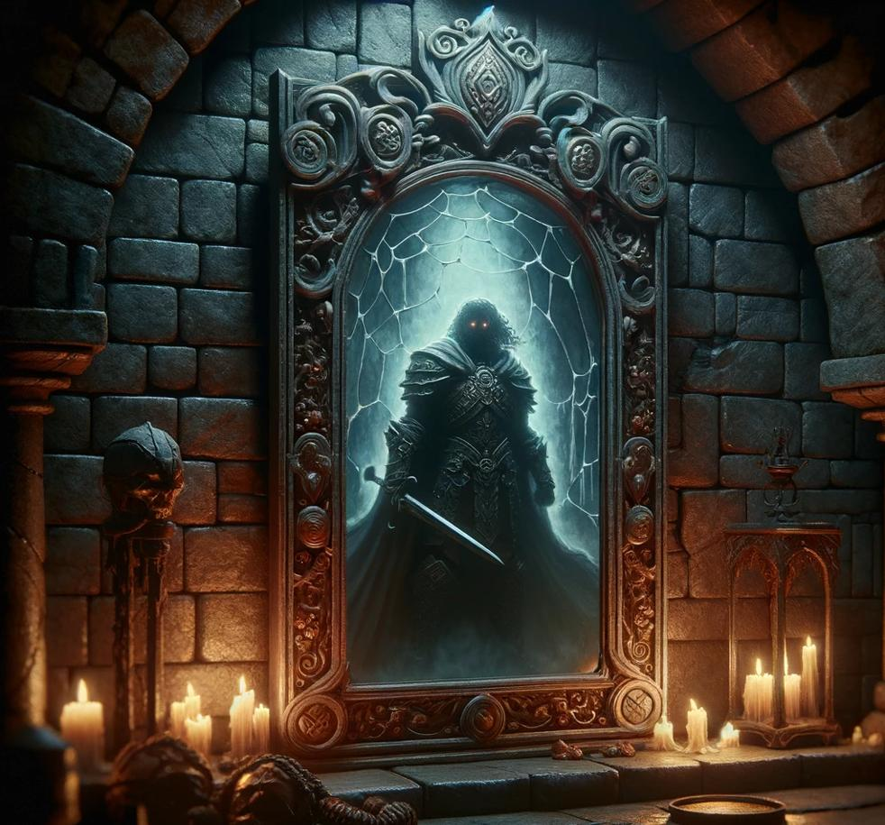
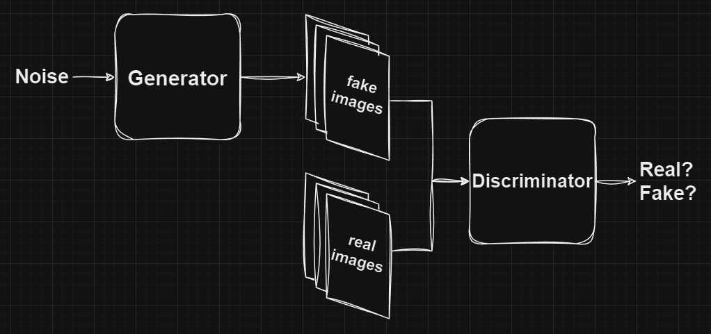
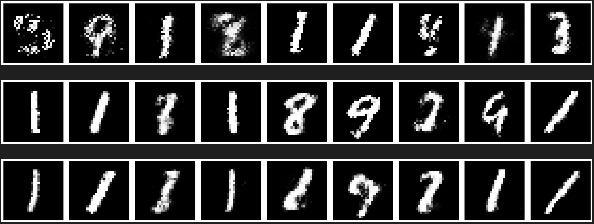
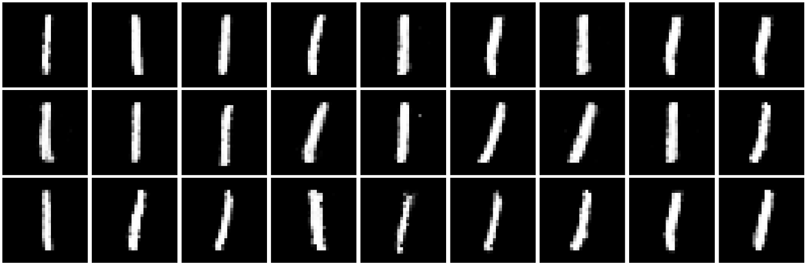
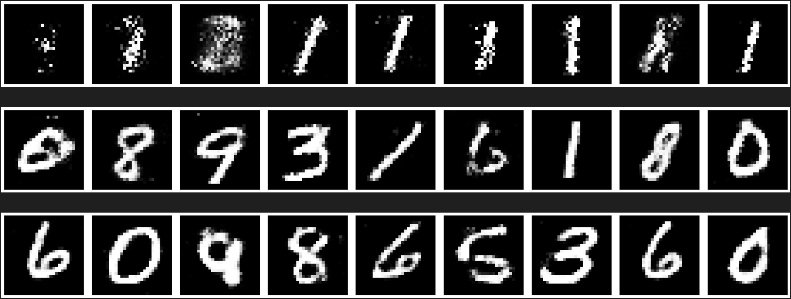
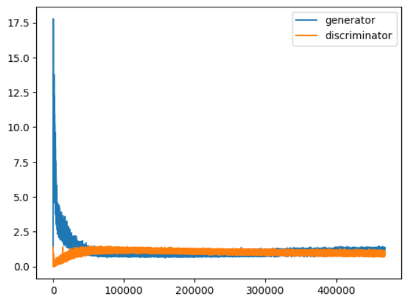
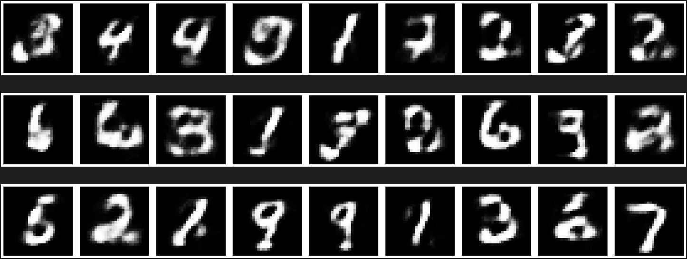
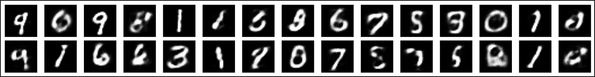
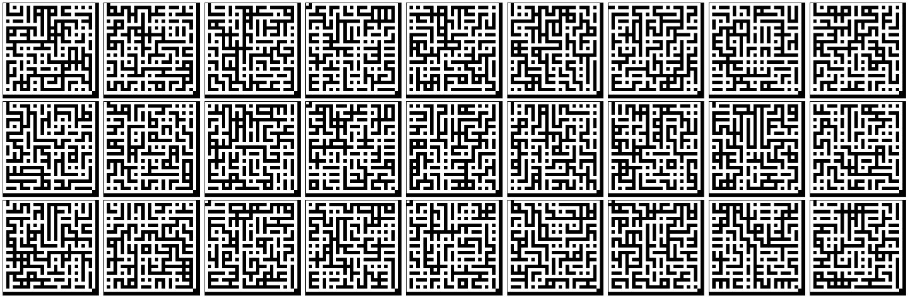

*The Mirror of Life Trapping, a relic of ancient magic, ensnares the souls of those who dare gaze upon its deceptive surface. Within its mystical depths, trapped spirits linger, awaiting release or eternal confinement.*



## The Quest
Craft a Mirror of Life Trapping. Capture the visual essence of a target.

## GAN (Generative Adversarial Network)
GAN is an architecture merging two different networks competing with each other:
- Discriminator: wants to predict if the input is real or fake
- Generator: wants to generate fakes indistinguishable from the real ones



### Discriminator
The discriminator is a simple binary classifier. Takes an image, returns a prediction of real / fake.

```python
class Discriminator(nn.Module):
    def __init__(self):
        super().__init__()
        self.layers = nn.Sequential(
            nn.Flatten(start_dim=1),
            nn.Linear(IMG_DIMS**2, HIDDEN_DIMS),
            nn.LeakyReLU(0.2),  # supposed to help with mode collapse
            nn.Linear(HIDDEN_DIMS, HIDDEN_DIMS),
            nn.LeakyReLU(0.2),
            nn.Linear(HIDDEN_DIMS, 1),
            nn.Sigmoid()
        )

    def forward(self, image):
        return self.layers(image)
```

### Generator
The generator takes some noise as input because network are deterministic. So in order to produce diverse results we need a source of randomness we can tap from. And produces an image.

```python
class Generator(nn.Module):
    def __init__(self):
        super().__init__()
        self.layers = nn.Sequential(
            nn.Linear(NOISE_DIMS, HIDDEN_DIMS),
            nn.BatchNorm1d(HIDDEN_DIMS),
            nn.ReLU(),
            nn.Linear(HIDDEN_DIMS, HIDDEN_DIMS),
            nn.BatchNorm1d(HIDDEN_DIMS),
            nn.ReLU(),
            nn.Linear(HIDDEN_DIMS, HIDDEN_DIMS),
            nn.BatchNorm1d(HIDDEN_DIMS),
            nn.ReLU(),
            nn.Linear(HIDDEN_DIMS, IMG_DIMS**2),
            nn.Sigmoid(),
            nn.Unflatten(1, (1, IMG_DIMS, IMG_DIMS))
        )

    def forward(self, noise):
        return self.layers(noise)
```

### Training
Training is where the magic happens. The discriminator is pretty straightforward. We take real pictures labelled as real, fake pictures made by the generator and label them as fake. And train.

So far so good. But how can we train the generator? The generator is initialized with random weight, fed random noise as a source of entropy and somehow we expect structured realistic outputs?

The idea is to use the discriminator that has seen real pictures and so is learning the properties of real pictures in the chain of gradient for the generator, and backpropagate the knowledge all the way back to the generator.

```python
def train_gan(discriminator, generator, data=data, epochs=EPOCHS, lr=LEARNING_RATE):
    opt_d = torch.optim.Adam(discriminator.parameters(), lr=lr)
    opt_g = torch.optim.Adam(generator.parameters(), lr=lr)

    for epoch in range(epochs):
        for minibatch, _ in data:
            batch_size = minibatch.size(0)
            minibatch = minibatch.to(device)
            real_labels = torch.ones(batch_size, 1).to(device)
            fake_labels = torch.zeros(batch_size, 1).to(device)
            noise = torch.randn(batch_size, NOISE_DIMS, device=device)
            fake_images = generator(noise)

            # discriminator
            outputs_real = discriminator(minibatch)
            loss_real = F.binary_cross_entropy(outputs_real, real_labels)
            outputs_fake = discriminator(fake_images.detach())
            loss_fake = F.binary_cross_entropy(outputs_fake, fake_labels)
            loss_d = loss_real + loss_fake
            discriminator.zero_grad()
            loss_d.backward()
            opt_d.step()

            # generator
            outputs = discriminator(fake_images)
            loss_g = F.binary_cross_entropy(outputs, real_labels)
            generator.zero_grad()
            loss_g.backward()
            opt_g.step()
```



### The curse of Mode Collapse
Unfortunatly the training can't be that easy. Not since the grim necromancers of the past corrupted the land with their dark rituals. Mode Collapse is when the generator "collapse" into a single state. Instead of working at learning to generate each sample with equal probability. It'll specialize, and only generate a few or even a single sample.

In my case if I let it train for too long on MNIST. It collapses and only generate Ones.



## Instance Noise
One way to fight with mode collapse is to introduce noise in the Discriminator. Add a layer of noise to the real and fake images to make them more "similar" so their distributions aren't so far appart. And so we can have a better gradient to work with.

```python
def train_gan_instance_noise(discriminator, generator, noise_std=0.1, data=data, epochs=EPOCHS, lr=LEARNING_RATE):
    def noisify(images):
        return images + torch.randn_like(images).to(device) * noise_std

    opt_d = torch.optim.Adam(discriminator.parameters(), lr=lr)
    opt_g = torch.optim.Adam(generator.parameters(), lr=lr)

    for epoch in range(epochs):
        for minibatch, _ in data:
            batch_size = minibatch.size(0)
            minibatch = minibatch.to(device)
            real_labels = torch.ones(batch_size, 1).to(device)
            fake_labels = torch.zeros(batch_size, 1).to(device)
            noise = torch.randn(batch_size, NOISE_DIMS, device=device)
            fake_images = generator(noise)

            # discriminator
            outputs_real = discriminator(noisify(minibatch))
            loss_real = F.binary_cross_entropy(outputs_real, real_labels)
            outputs_fake = discriminator(noisify(fake_images.detach()))
            loss_fake = F.binary_cross_entropy(outputs_fake, fake_labels)
            loss_d = loss_real + loss_fake
            discriminator.zero_grad()
            loss_d.backward()
            opt_d.step()

            # generator
            outputs = discriminator(fake_images)
            loss_g = F.binary_cross_entropy(outputs, real_labels)
            generator.zero_grad()
            loss_g.backward()
            opt_g.step()
```




## WGAN (Wasserstein Generative Adversarial Network)
Another way is to somehow force the gradient to have a bounded slope so we avoid getting into the long tail of the derivative. One way to achieve that is to clip the values of the weights in the network. This will cause the network to learn slower so we also need to give more iterations to the discriminator to compensate for it. It also forces us to get rid of Adam because the momentum is causing problems.

```python
def train_wgan(discriminator, generator, clip_threshold=0.01, extra_discriminator_training=10, data=data, epochs=EPOCHS, lr=LEARNING_RATE):
    opt_d = torch.optim.RMSprop(discriminator.parameters(), lr=lr)
    opt_g = torch.optim.RMSprop(generator.parameters(), lr=lr)

    for epoch in range(epochs):
        for minibatch, _ in data:
            batch_size = minibatch.size(0)
            minibatch = minibatch.to(device)
            noise = torch.randn(batch_size, NOISE_DIMS, device=device)
            fake_images = generator(noise)

            # discriminator
            for _ in range(extra_discriminator_training):
                outputs_real = discriminator(minibatch)
                outputs_fake = discriminator(fake_images.detach())
                loss_d = outputs_fake.mean() - outputs_real.mean()
                discriminator.zero_grad()
                loss_d.backward()
                opt_d.step()
                for p in discriminator.parameters():
                    p.data.clamp_(-clip_threshold, clip_threshold)

            # generator
            outputs = discriminator(fake_images)
            loss_g = -outputs.mean()
            generator.zero_grad()
            loss_g.backward()
            opt_g.step()
```



### Both
Or use a combination of both

```python
def train_wgan_noise(discriminator, generator, noise_std=0.01, clip_threshold=0.01, extra_discriminator_training=10, data=data, epochs=EPOCHS, lr=LEARNING_RATE):
    def noisify(images):
        return images + torch.randn_like(images).to(device) * noise_std
    
    opt_d = torch.optim.RMSprop(discriminator.parameters(), lr=lr)
    opt_g = torch.optim.RMSprop(generator.parameters(), lr=lr)

    for epoch in range(epochs):
        for minibatch, _ in data:
            batch_size = minibatch.size(0)
            minibatch = minibatch.to(device)
            noise = torch.randn(batch_size, NOISE_DIMS, device=device)
            fake_images = generator(noise)

            # discriminator
            for _ in range(extra_discriminator_training):
                outputs_real = discriminator(noisify(minibatch))
                outputs_fake = discriminator(noisify(fake_images.detach()))
                loss_d = outputs_fake.mean() - outputs_real.mean()
                discriminator.zero_grad()
                loss_d.backward()
                opt_d.step()
                for p in discriminator.parameters():
                    p.data.clamp_(-clip_threshold, clip_threshold)

            # generator
            outputs = discriminator(fake_images)
            loss_g = -outputs.mean()
            generator.zero_grad()
            loss_g.backward()
            opt_g.step()
```



Subjectively I like the visual of the Instance Noise better, the result feel more crisp, while the GAN gives me a sensation of afterimage, some ghost lines and bluriness. But both methods seem to help with the mode collapse. I've let them both train for a few hours and still got a sample of different numbers generated.

## Generate Mazes
As the tradition goes, let's make some mazes so we get a point of comparison with the VAE.



## The code
You can get the code at https://github.com/peluche/daedalus

## Sources
- GAN: https://arxiv.org/abs/1406.2661
- WGAN: https://arxiv.org/abs/1701.07875
- Improve training: https://youtu.be/RdC4XeExDeY
