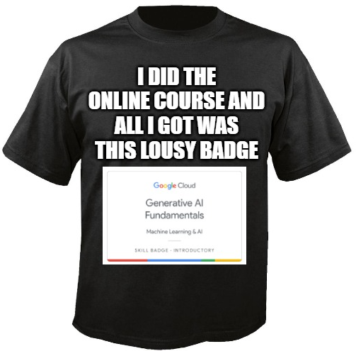

A look at Google Introduction to Generative AI Learning Path https://www.cloudskillsboost.google/journeys/118.

"Learning Path" is a bit of a misnomer, as the site does not involve much learning. The course is split into 5 chapters consisting of short videos and quizzes.

## Chapter 1: Introduction to Generative AI
Covers a bit of semantics:
- AI (theoretical field) vs ML (practical methods)
- supervised vs unsupervised
- discriminative vs generative models

## Chapter 2: Introduction to Large Language Models
Brush up on fine tuning, and PETM (Parameter-Efficient Tuning) and the Google ecosystem.

## Chapter 3: Introduction to Responsible AI
Is mostly virtue signaling:
- ai should be socially beneficial
- avoid viais
- tested for safety
- accountable to people
- respect privacy
- apply scientific excellence
- available to all users?

## Chapter 4: Generative AI Fundamentals
This one was just a quiz.

## Chapter 5: Responsible AI: Applying AI Principles with Google Cloud
And this one was just videos. The perfect combo of rambling of previous videos, rambling within the videos themselves, and additional virtue signaling 🤩.

## Conclusion
Nothing to see here. Don't spend your time on it.

