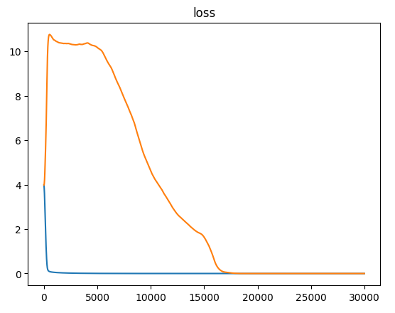
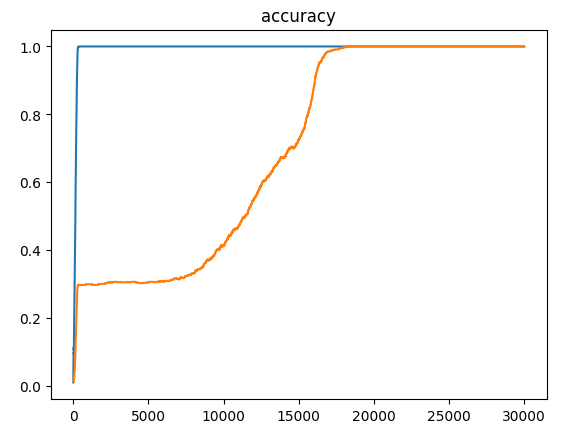
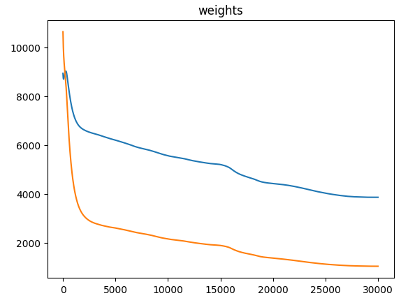
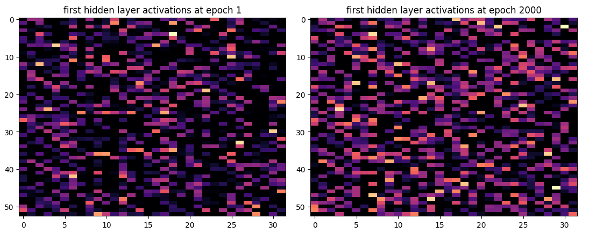
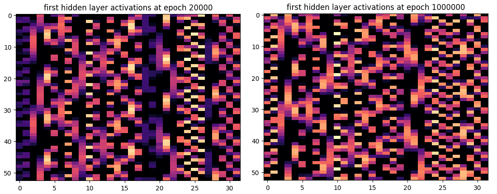
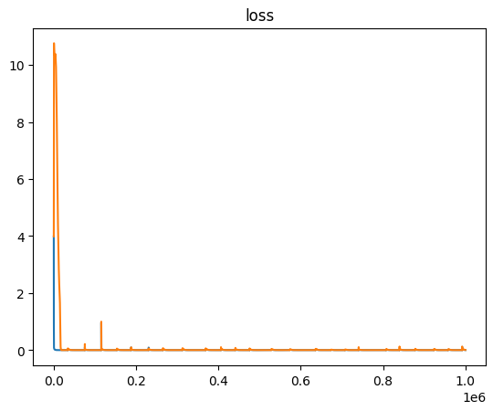
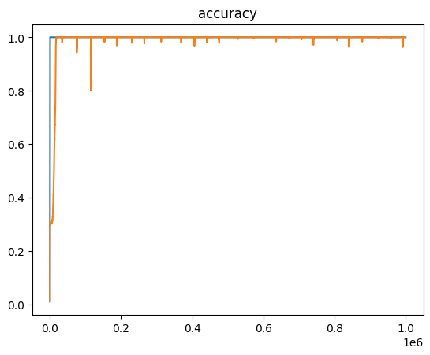
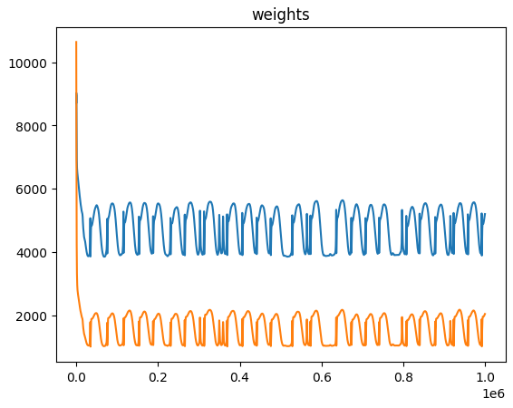

Say hi to our new bestiary friend, Grok.


## The Quest
Let's explore how a network can generalize the solution after already reaching perfect loss.

## Grokking
Grokking is the model's ability to move beyond rote learning of training data and develop a broader understanding that allows it to generalize well to unseen inputs.

### The Model
We'll try to reproduce this effect using a model trained to predict modular addition `(a + b) % vocab`.

```python
class NN(nn.Module):
    def __init__(self):
        super().__init__()

        self.embed = nn.Embedding(n_vocab, n_embed)
        self.layers = nn.Sequential(
            nn.Linear(n_embed, n_hidden),
            nn.ReLU(n_hidden),
            nn.Linear(n_hidden, n_hidden),
            nn.ReLU(n_hidden),
            nn.Linear(n_hidden, n_vocab))

    def forward(self, x):
        a, b = x[:, 0], x[:, 1]
        # compute embedding
        a_embed = self.embed(a)
        b_embed = self.embed(b)
        # merge them
        embd = a_embed + b_embed
        return self.layers(embd)
```

### Dataset
The training is run over a random subset of 30% of the pairs of integers from our vocabulary and we train the model on full batches.

```python
X = [(i, j) for i in range(n_vocab) for j in range(n_vocab)]
random.shuffle(X)

X_train = X[: int(len(X) * split)]
X_test = X[int(len(X) * split):]
Y_train = [(i + j) % n_vocab for i, j in X_train]
Y_test = [(i + j) % n_vocab for i, j in X_test]

# train on full batch
def get_batch(name='train'):
    return {
        'train': (torch.tensor(X_train).to(device), torch.tensor(Y_train).to(device)),
        'test': (torch.tensor(X_test).to(device), torch.tensor(Y_test).to(device))
    }[name]
```

### Training
For the training we use AdamW as an optimizer and aim to minimize cross entropy.

```python
optimizer = optim.AdamW(model.parameters(), lr=learning_rate, weight_decay=weight_decay)

def evaluate(name):
    X, Y = get_batch(name)
    Y_hat = model(X)
    loss = F.cross_entropy(Y_hat, F.one_hot(Y, n_vocab).float())
    accuracy = (Y_hat.argmax(dim=1) == Y).float().mean()
    return loss, accuracy

@torch.no_grad()
def evaluate_test():
    return evaluate('test')

def evaluate_train():
    return evaluate('train')

# training loop
for i in tqdm(range(epoch)):
    loss, accuracy = evaluate_train()
    test_loss, test_accuracy = evaluate_test()
    optimizer.zero_grad()
    loss.backward()
    optimizer.step()
```

## Results
The model rapidly overfit the training data (in blue) and achieve perfect accuracy/loss by memorizing the inputs. Meanwhile performing terrible on the testing set (in orange). But after some tens of thousands of epochs something happen and the model "Grok" and generalize the solution to work on unseen inputs.





### How?
How can the model keep training when the loss is already perfect. This is where `AdamW` kicks-in. from epoch `~1000` and onward all the model is doing is trying to reduce the weights.



And by putting pressure onto minimizing the weights the model is forced to find a generic solution instead of memorizing each entry.

### Inside the model
While I can't claim to really understand exactly what the model is doing under the hood, looking at the neurons activation for the first hidden layer gives some feeling for structure emerging in the later stages of training.

Going from untrained to a memorized solution on the training set.



And from a memorized to a generalized solution working for the testing set.



## Open Questions (to me)
Some of the arcane are still inscrutable to my magic. So I'll leave a note scribbled on the margin of my bestiary to be solved at a later date.

### Why does it spike
I tried running the training for a million epochs just to see what would happen to the activations neurons after a long training, and I can't explain why the loss/accuracy keep spiking over time.







### Concatenated embeddings do not grok
In the model, the embeddings are computed for both numbers, and they are merged

```python
# compute embedding
a_embed = self.embed(a)
b_embed = self.embed(b)
# merge them
embd = a_embed + b_embed
```

Encoding the `+` in the forward pass feels like cheating, it feels like giving the network a freebie. So I experimented with just concatenating the embeddings to let the network do it's own thing instead.

```python
# compute embedding
a_embed = self.embed(a)
b_embed = self.embed(b)
# merge them
embd = torch.cat((a_embed, b_embed), dim=1)
```

And it never grokked. This is super counter intuitive to me. It would be trivial for the linear layer to emulate `a_embed + b_embed` by just setting the bias to zero and the weights as mostly zeros with a few ones at the correct positions.

## The code
You can get the code at https://github.com/peluche/grokking-modular-addition and additional graphs for the spikes in the [long-training branch](https://github.com/peluche/grokking-modular-addition/tree/long-training).



## Sources
This entry was inspired by a paper from [Neel Nanda](https://www.neelnanda.io/) and [Lawrence Chan](https://chanlawrence.me/) *Progress measures for grokking via mechanistic* interpretability https://arxiv.org/abs/2301.05217.

