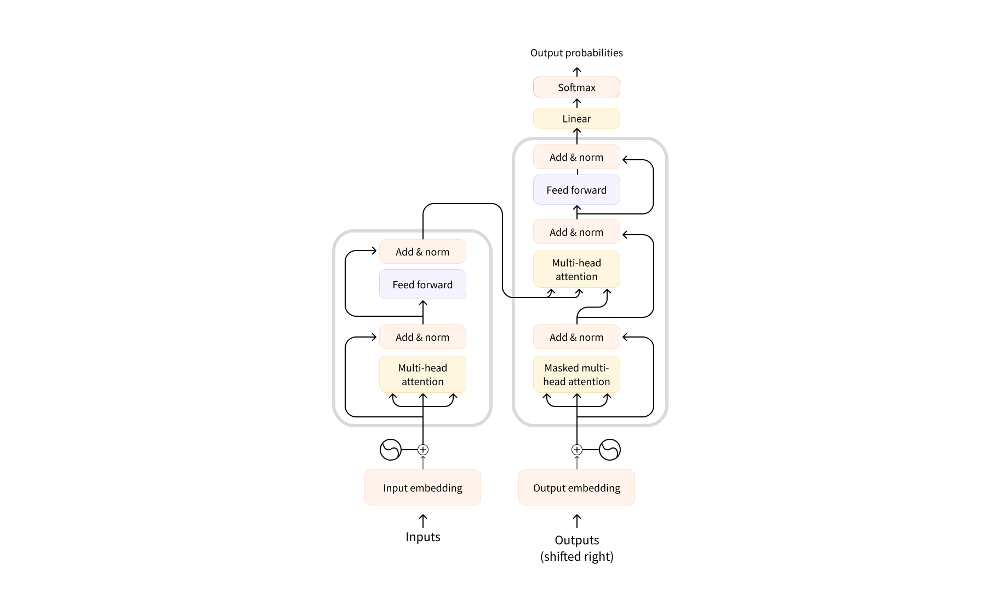

Today is time for the [🤗 Hugging Face: NLP Course](https://huggingface.co/learn/nlp-course).

## Chapter 1: Transformer Models
The first chapter is just a very quick glance at Hugging Face transformer capabilities. It's a rapidfire set of examples going through two-liners for:
- sentiment analysis
- NER (entity extraction)
- classification
- text generation / question answering
- fill mask
- translation

For example:
```python
from transformers import pipeline

classifier = pipeline("sentiment-analysis")
classifier([
  "I've been waiting for a HuggingFace course my whole life.",
  "I hate this so much!"
])

# [{'label': 'POSITIVE', 'score': 0.9598049521446228},
#  {'label': 'NEGATIVE', 'score': 0.9994558691978455}]
```

## Chapter 2: Using 🤗 Transformers
Chapter 2 goes a little bit into what `pipeline()` actually do. And break the differents steps happening behind the scene:
- using tokenizers
- loading a checkpoint for a pre-trained model
- and postprocessing

This chapter covers a bit of theory on transformers as described in the original paper [Attention Is All You Need](https://arxiv.org/abs/1706.03762) by Ashish Vaswani et al.



As well as the different types of tokenizers:
- Word based
- Character based
- Subword based

It seems to me that Subword based tokenizers are the most "realworld" of the bunch and the other are mostly included for historical value sakes. Subword tokenizers make the tradeoff to limit the vocabulary size compared to Word based ones, while maintaining a higher semantic value than Character based. And generally using additional cleverness to split words in a semantically meaningful way e.g.

```python
from transformers import AutoTokenizer

tokenizer = AutoTokenizer.from_pretrained("bert-base-cased")
tokens = tokenizer.tokenize(sequence)
print(tokens)

# ['Using', 'a', 'Trans', '##former', 'network', 'is', 'simple']
```

Notice how `'Transformer'` has been split into 2 tokens `['Trans', '##former']`. Using the radical of the word and a continuation denoted by the `##`. This kind of euristics aim to maximize the amount of semantic of each token.

My follow along version of the code is on [GitHub](https://github.com/peluche/huggingface-NLP-course) or bellow.


