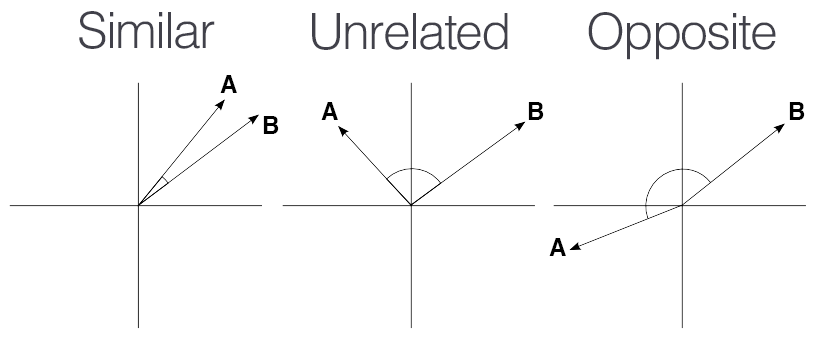

Continuing with [🤗 Hugging Face: NLP Course](https://huggingface.co/learn/nlp-course).

## Chapter 3: Fine-Tuning a Pretrained Model
Goes over fine-tuning. It's a OK as a source of copy/pastable snippets, but there isn't much insight to glean from here.

## Chapter 4: Sharing Models and Tokenizers
Nothing to see here. Just an advertisement for the 🤗 platform.

## Chapter 5: The 🤗 Datasets Library
Another OK source of copy/pastable snippets. But this time we also get a treat, an intro to [FAISS (Facebook AI Similarity Search)](https://ai.meta.com/tools/faiss/).

The end of the chapter introduce embeddings. And how to find the sementically closest neighbour using [Cosine Similarity](https://en.wikipedia.org/wiki/Cosine_similarity).

Go get a look at the original at https://huggingface.co/learn/nlp-course/chapter5/6



My follow along version of the code is on [GitHub](https://github.com/peluche/huggingface-NLP-course) or bellow.


