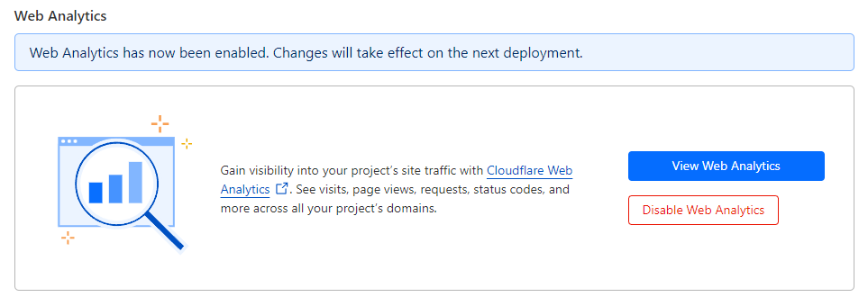
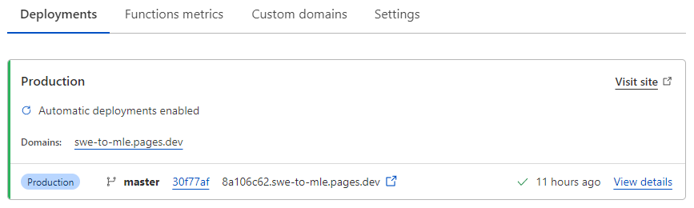

# Learn in Public

This is the start of an experiment. There's an internet theory that you can learn faster about any topic if you learn it in public [source](https://www.swyx.io/learn-in-public).

So I'm going to be rambling in here while I transition from Software Engineer to ML Engineer.

To start, I need a place to ramble so we set up a blog using:
- [GitHub](https://github.com/) to host the code
- [Hugo](https://gohugo.io/) (with the [loveit theme](https://hugoloveit.com/)) to convert markdown to pretty HTML
- [Cloudflare Pages](https://pages.cloudflare.com/) to serve the HTML
- [Utterances](https://utteranc.es/) for comments

```sh
sudo apt install hugo
hugo new site SWE-to-MLE
cd SWE-to-MLE/
git init .
git submodule add https://github.com/dillonzq/LoveIt.git themes/loveit
echo "theme = 'loveit'" >> config.toml
hugo new posts/learn-in-public/index.md
emacs content/posts/learn-in-public.md
hugo serve
open http://localhost:1313
```

There are a bunch more edits going in the `config.toml`. You can just follow [the theme documentation](https://hugoloveit.com/theme-documentation-basics/) or take a look at [my config](https://github.com/peluche/SWE-to-MLE/blob/master/config.toml)

This gives us a basic skeleton running locally. Now, to host it on the internet, push it to GitHub.

```sh
# create repo on github.com then
git remote add origin https://github.com/peluche/SWE-to-MLE.git
git push origin main
```

Register an account with cloudflare https://pages.cloudflare.com/ and give it access to your GitHub repo. Now, the code will get picked up automatically when you push, and you don't have to manage anything. There's also a oneclick option to enable analytics.



Now, to setup some comments, we're using https://utteranc.es/. It stores comments as issues on GitHub. Give permission to the [Utterances app](https://github.com/apps/utterances) to your repo and add the info to your `config.toml`.

```toml
  [params.page]
    [params.page.toc]
      enable = true
    [params.page.comment]
      enable = true
      [params.page.comment.utterances]
        enable = true
        repo = "peluche/SWE-to-MLE"
        issueTerm = "pathname"
```

commit, push, wait for cloudflare to pick it up



and we are good to start rambling.
