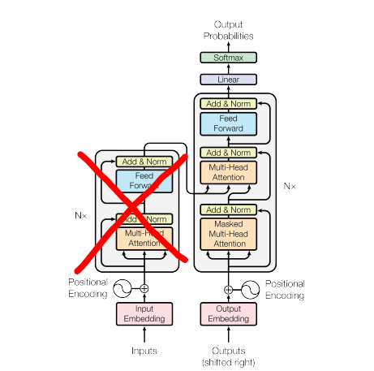
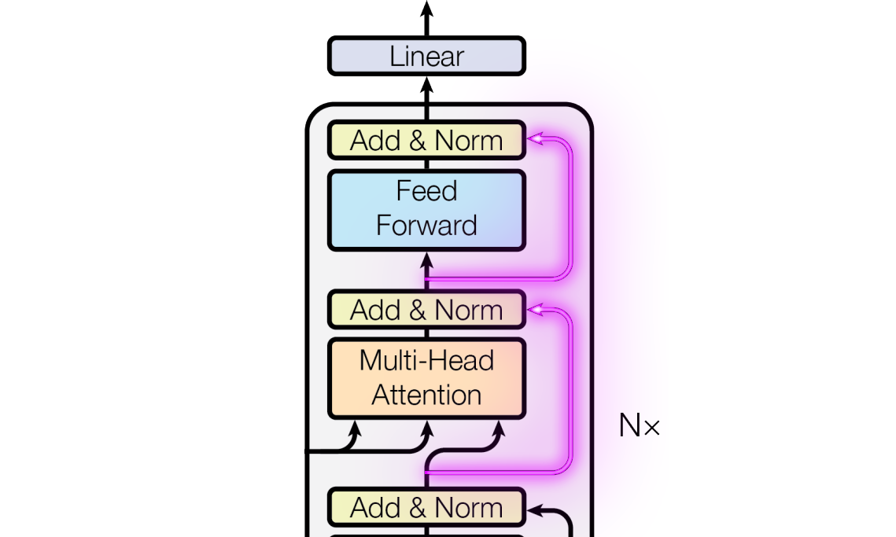

A look at episode #7: [Let's build GPT: from scratch, in code, spelled out](https://youtu.be/kCc8FmEb1nY?list=PLAqhIrjkxbuWI23v9cThsA9GvCAUhRvKZ) from [Andrej Karpathy](https://karpathy.ai/) amazing tutorial series.



For the final episode of the series 😭 we keep all the little things about reading, partitioning and tokenizing the dataset from previous videos. And start a new model from scratch to generate some shakespeare sounding text.

## The model
The model is inspired GPT-2 and the [Attention is All You Need paper](https://arxiv.org/abs/1706.03762). This is a **very dense lecture** and it takes a lot of time to unpack.

It starts as an N-gram model and slowly morph into a decoder-only transformer.



### Positional Encoding
The embeddings vectors we have been using for makemore were carrying the meaning of the tokens, but didn't represent their position in the inputs. Positional Encoding is meant to change that by shifting the embeddings in space depending on their position in the sentence. The video use learned positional embeddings (for simplicity?):

```python
def __init__(self):
  super().__init__()
  self.token_embedding_table = nn.Embedding(vocab_size, n_embd)
  self.position_embedding_table = nn.Embedding(block_size, n_embd)
  ...

def forward(self, idx):
  tok_emb = self.token_embedding_table(idx)
  pos_emb = self.position_embedding_table(torch.arange(T, device=device))
  x = tok_emb + pos_emb
  ...
```

but the paper originally suggest using FFT looking values:

$$PE_{(pos, 2i)} = sin(pos/10000^{2i/d_{model}})$$
$$PE_{(pos, 2i+1)} = cos(pos/10000^{2i/d_{model}})$$

### Self-Attention
This is to me the densest part of it all. And had to pause the video and go have a look at [other material](https://sebastianraschka.com/blog/2021/dl-course.html#l19-self-attention-and-transformer-networks) to get [more angles](https://e2eml.school/transformers.html) on it.

The endgoal is to have embeddings talk to each other to enrich their meaning with the sentence context (by using `Query` aka. "what do I care about", combined with `Key` aka. "what I know about", to scale `Value` aka. "slightly transformed embeddings").

With my current understanding I believe the intuition behind using the dot product of the `Query` and `Key` to be analogous to mechanism used in nearest neighbor search. We use some mathematical tool (`dot product` for attention, and `cosine similarity` for KNN) to compare vectors in a way that gives us higher values for more similar vectors. And use that to scale how much we care about a given pair of vectors.

## Improve Training
The second half of the video focus on how to speedup training.


### Residual Connections
This lools like bypassing a component of the model. Adding an extra trace on the PCB that goes around your chip, in the paper it looks like that:



And in code like this:

```python
def forward(self, x):
  x = x + self.sa(self.ln1(x))
  x = x + self.ffwd(self.ln2(x))
  return x
```

It works because `+` distribute the gradient, so instead of only receiving the gradient of the gradient, we get our own copy too, and we get to train faster 🙌.

### LayerNorm
This is the same intuition as `BatchNorm` from the makemore series. Without all the messy internal state we have to carry around, because we only normalize a row instead of a column, so all the data we need is always there to be computed on the fly.

It looks a little something like:

```python
class LayerNorm:
    def __init__(self, dim, eps=1e-5):
        self.eps = eps
        self.gamma = torch.ones(dim)
        self.beta = torch.zeros(dim)

    def __call__(self, x):
        xmean = x.mean(dim=1, keepdim=True)
        xvar = x.var(dim=1, keepdim=True)
        xhat = (x - xmean) / torch.sqrt(xvar + self.eps)
        self.out = self.gamma * xhat + self.beta
        return self.out
    
    def parameters(self):
        return [self.gamma, self.beta]
```

It works for the same reason BatchNorm worked, by squeezing the values close to softmax sweet spot `[-1, 1]` so we don't get vanishing gradients.

### Dropout
This one is more of a regularization trick to prevent overfitting. It works by randomly shutting down some percentage of neurons for a layer.

## Final words
Andrej Karpathy is an amazing teacher. The title [Neural Networks: Zero to Hero](https://karpathy.ai/zero-to-hero.html) delivers all it promised and more. The lectures share the same aura of brilliance as the Feynman series on physics. And the code has the simple elegance you'd find in a Peter Norvig essay. For a world-class course on ML, thank you Mr. Karpathy.

## The code
Here's my take on the tutorial with additional notes. You can get the code on [GitHub](https://github.com/peluche/makemore) or bellow.

