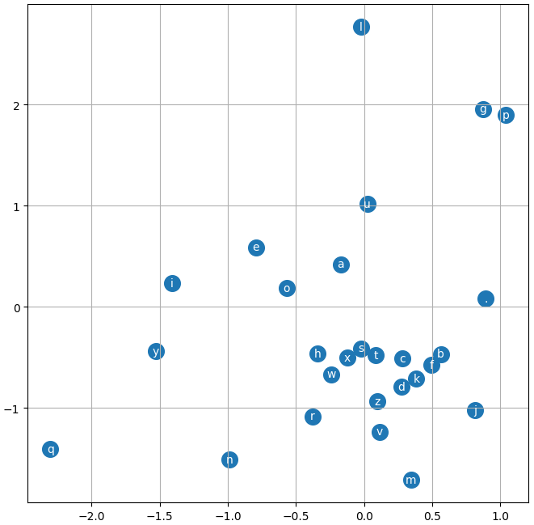

A look at episode #3: [The spelled-out intro to language modeling: building makemore Part 2: MLP](https://youtu.be/TCH_1BHY58I?list=PLAqhIrjkxbuWI23v9cThsA9GvCAUhRvKZ) from [Andrej Karpathy](https://karpathy.ai/) amazing tutorial series.



It picks up where the previous makemore video ended. Going from a bigram character-level Language Model to an N-gram MLP character-level Language Model. Meaning: "given the last N characters embeddings, guess the next character". It's still trained on a list of names to produce new unique name-sounding words.

The lecture is inspired by [Bengio et al. 2003](https://www.jmlr.org/papers/volume3/bengio03a/bengio03a.pdf)

## Embeddings

Makemore2 introduces a bunch of new notions. Starting with Embeddings. The first stage of the model take a character as one hot encoded vector, and convert it into a multi-dimensional vector representation. Bellow we can see each letters mapped into a 2D vector space.



Notice how the characters do not look uniformely distributted. Instead there are clusters of consonants and vowels. The model learned something about letters for our dataset and decided that `x`, `s`, and `t` were very similar, while `q` and `l` were big outliers.

## Hyperparameters and Training
This section introduce more rigor and for the first time we split our data into:
- ~80% training (used to train the parameters)
- ~10% dev/validation (used to train the hyperparameters)
- ~10% test (used to validate the performance at the very end, this has to stay pure, it should be used as few as possible. Ideally you never touch it, and evaluate the loss on it a single time just before pushing your results)

There's some intuition on how to find a good Learning Rate and why you should use Learning Rate Decay later in the training process. And how to find bottlenecks in the training. If the model does not outperform the validation set with the training set it's probably underfitting which might come from:
- The hidden layers are probably too small, we could get better performances by increasing the number of weights.
- The embedding space has too few dimensions (i.e. we only used 2-dimensional embeddings).
- It could also mean that we are using too small of a minibatch. Making the data too noisy for the gradient computation to converge.

## Recommended reading material in the lecture
### PyTorch internals
[PyTorch internals by Edward Z. Yang](http://blog.ezyang.com/2019/05/pytorch-internals/). The bits relevant to this lesson are at the beginning of the blogpost: Why it's easy to make zero-cost copy in PyTorch using views. Because views are just a thin wrapper over the data with a size (dimensions), and stride (how to skip to the next element). The rest of the blogpost is a bit overkill unless you are planning to contribute to the PyTorch codebase.

### Paper: A neural Probabilistic Language Model
[Bengio et al. 2003](https://www.jmlr.org/papers/volume3/bengio03a/bengio03a.pdf)

## Gotcha in the video: Softmax logits can be arbitrarily offset-ed
Andrej glance over the fact in the video. But it wasn't intuitive to me so here's a spelled out version of it.

$Softmax([x, y, z]) = Softmax([x + k, y + k, z + k])$

for a reminder softmax is: $Softmax(x) = {e^x \over {\sum_i e^i}}$

or in code:
```python
import torch

for k in range(-10, 10):
    # offsetting the logits by `k`
    logits = torch.tensor([1, 2, 3]) + k
    count = logits.exp()
    probs = count / count.sum()
    print(f'{k=}\t {probs=}')
```

```python
# k=-10	 probs=tensor([0.0900, 0.2447, 0.6652])
# k=-9	 probs=tensor([0.0900, 0.2447, 0.6652])
# ...
# k=0	 probs=tensor([0.0900, 0.2447, 0.6652])
# k=1	 probs=tensor([0.0900, 0.2447, 0.6652])
# ...
# k=8	 probs=tensor([0.0900, 0.2447, 0.6652])
# k=9	 probs=tensor([0.0900, 0.2447, 0.6652])
```

$$Softmax(x + k) = {e^{x + k} \over \sum {e^{i}}}$$
$$= {e^{x + k} \over e^{x + k} + e^{y + k} + e^{z + k}}$$
$$= {e^{x} e^{k} \over e^{x} e^{k} + e^{y} e^{k} + e^{z} e^{k}}$$
$$= {e^{x} e^{k} \over (e^{x} + e^{y} + e^{z}) e^{k}}$$
$$= {e^{x} \over e^{x} + e^{y} + e^{z}}$$

The `k` cancel out so we can safely shift the values of the Softmax logits to prevent floating arithmetic error that would be caused by computing high exponential values e.g.:

```python
will_overflow = torch.tensor([1, 10, 100]).exp()
will_not_overflow = (torch.tensor([1, 10, 100]) - 100).exp()

print(f'{will_overflow=}')
print(f'{will_not_overflow=}')
```

```python
# will_overflow=tensor([2.7183e+00, 2.2026e+04,        inf])
# will_not_overflow=tensor([1.0089e-43, 8.1940e-40, 1.0000e+00])
```

Note the `inf` for `e**100` while the second vector is perfectly fine.

## The code

Here's my take on the tutorial with additional notes. You can get the code on [GitHub](https://github.com/peluche/makemore) or bellow.


