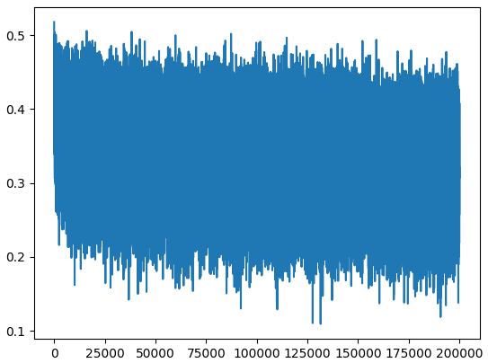
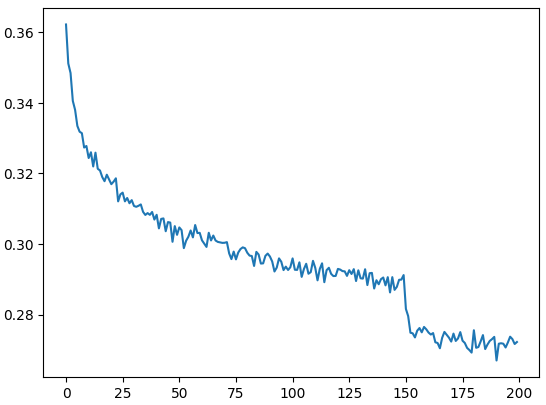
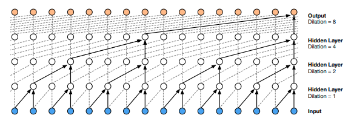
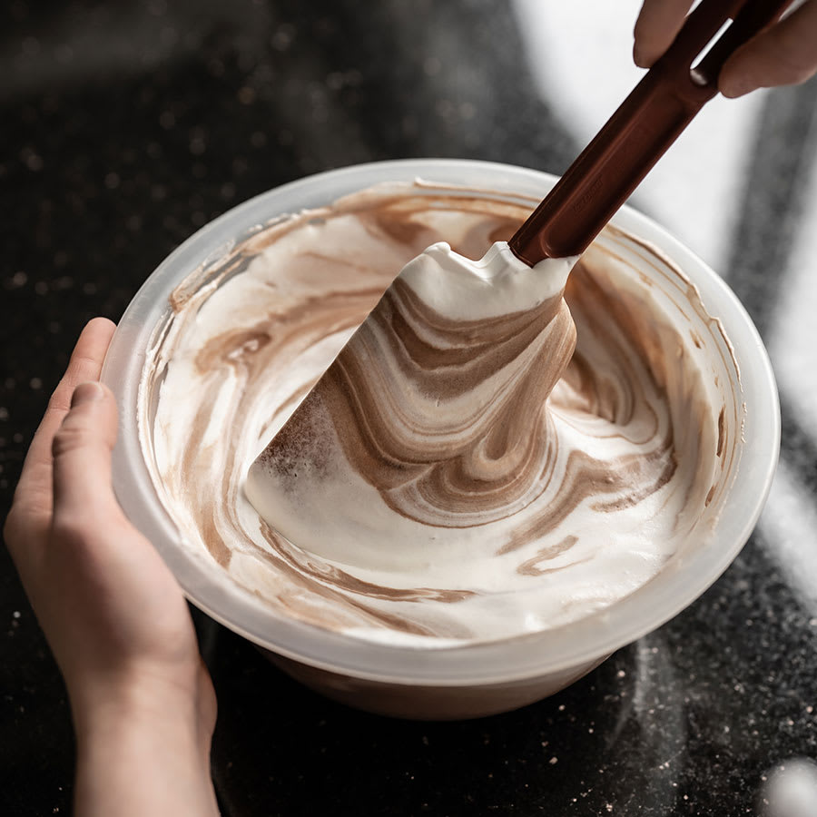

A look at episode #6: [The spelled-out intro to language modeling: Building makemore Part 5: Building a WaveNet](https://youtu.be/t3YJ5hKiMQ0?list=PLAqhIrjkxbuWI23v9cThsA9GvCAUhRvKZ) from [Andrej Karpathy](https://karpathy.ai/) amazing tutorial series.



Starting from the makemore3 (3-gram character-level MLP model) code as a base. It implements a deepter more structured model (while maintaining roughly the same number of parameters) to improve the loss.

## Improve the structure of the code
The first half of the video focus on bringing more structure to the code. The forward pass get refactored into a model class heavily inspired by PyTorch [torch.NN](https://pytorch.org/docs/stable/nn.html). The loss visualization also receive some love, and get smoothed out by taking the mean of the loss over a bunch of batches to improve legibility.

Going from:

```python
plt.plot(lossi)
```



To:

```python
plt.plot(torch.tensor(lossi).view(-1, 1000).mean(1))
```




## Changing the model architecture
The architecture change is inspired by the [WaveNet 2016 paper](https://arxiv.org/abs/1609.03499) focussing on the _stack of dilated causal convolutional layers_ (aka. merging character embeddings 2 by 2 in the shape of a binary tree instead of all at once).



This is meant to preserve more of the meaning associated with each pair of embeddings by incorporating them together more gradually. Anyone else gets reminded of a cooking recipe here?

_Gently fold the ~~beaten egg whites~~ **embeddings** into the rich, melted ~~chocolate mixture~~ **causal layers**, taking care not to deflate them._



### Why does WaveNet use a convolutional architecture?
TL;DR: It's faster.

Convolutional NN let you do efficient sliding window operations by (1) Running all in CUDA-land instead of a python loop, and (2) by making it possible to re-use shared state instead of recomputing everything for each offset of the sliding window.

## The code
Here's my take on the tutorial with additional notes. You can get the code on [GitHub](https://github.com/peluche/makemore) or bellow.

