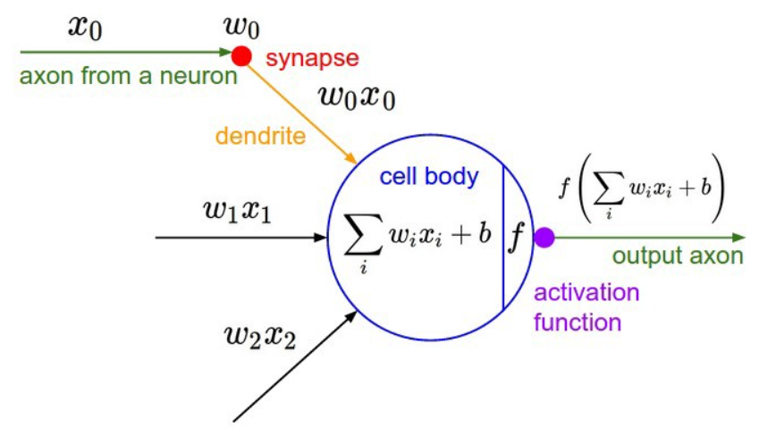

Today I'm talking about [Andrej Karpathy](https://twitter.com/karpathy) excellent tutorial series [The spelled-out intro to neural networks and backpropagation: building micrograd](https://youtu.be/VMj-3S1tku0?list=PLAqhIrjkxbuWI23v9cThsA9GvCAUhRvKZ).



This session covers a full intruduction to backpropagation. Starting with building a strong intuition of derivatives and their usages in ML. Beginning with numerical derivation, followed by symbolic derivation, and finally automating it by wrapping Python's primitive operations (`+`, `-`, `*`, `/`, `exp`, `tanh`) with code.

It then goes into learning. Covering what is a Neuron



and how to run a forward pass followed by backpropagation on it. Updrating the weights based on the computed gradients to training a Multi Layer Perceptron


on a tiny tinsy 4 points dataset.

```python
xs = [
  [2.0, 3.0, -1.0],
  [3.0, -1.0, 0.5],
  [0.5, 1.0, 1.0],
  [1.0, 1.0, -1.0],
]
ys = [1.0, -1.0, -1.0, 1.0]
```

The tutorial is filled with gold. Andrej goes into real details of how (and why!) everything works from first principles. He also intentionally let common bugs that emerge during implementation unedited in the video and address them as a cautionary tale:
- [overwritting gradients in microcrad instead of updating them](https://youtu.be/VMj-3S1tku0?list=PLAqhIrjkxbuWI23v9cThsA9GvCAUhRvKZ&t=4946)
- [not zeroing the gradients between batches](https://youtu.be/VMj-3S1tku0?list=PLAqhIrjkxbuWI23v9cThsA9GvCAUhRvKZ&t=7821)

Here's my take on the tutorial with additional notes. You can get the code on [GitHub](https://github.com/peluche/micrograd/) or bellow.



