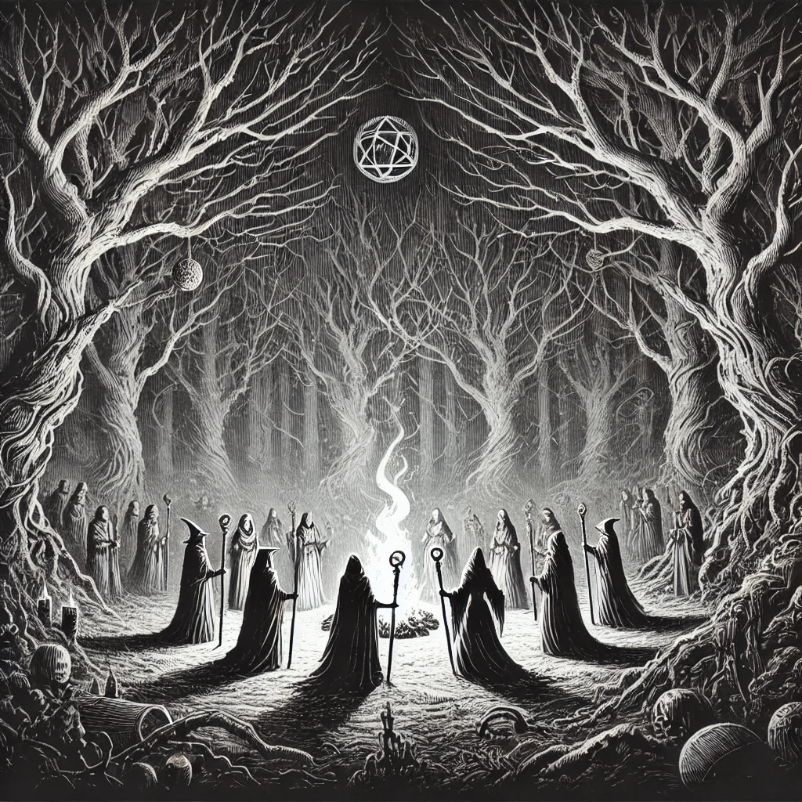
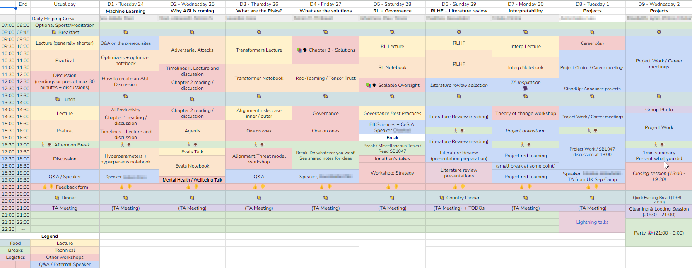

I recently came back from the ML4Good Germany Camp 2024 https://www.ml4good.org/. I'm glad I went and here's why you should too.

## The Quest
Visit the neighboring AI Safety Covenant for a gathering of Witches and Wizards.

## What is ML4Good Camp
It's a 10-day in-person camp with a bunch of cool people learning and working on AI safety. We were 25 participants mostly from across Europe, 5 TAs, 3 organizers, and even a cook! We all gathered in ~~an ancient castle with towering spires, vast dungeons, and enchanted forests~~ a giant house in the middle of nowhere Germany.

## Why you should apply too
I was impressed by how special each participant was. Going from students to researchers, from PhDs to serial entrepreneurs, people deep in the technical to working on governance, computer scientists, engineers, mathematicians, physicists, philosophers, linguists ...

The program is a mix of technical lectures, pair programming on notebooks (think a lighter version of ARENA material), reading and discussion groups, guest speaker events, career consulting, and closing projects toward the end.

A lot of people ended up applying for other programs like MATS (https://www.matsprogram.org/) after the camp or forming teams for hackathons.

## Why you should not apply
It's a trap, they'll bewitch you with their sirens' songs of promised knowledge and entertainment! I'm now stuck with a giant backlog of fantasy books, AI Safety podcasts, blog posts, and paper recommendations to last me many Winters!
