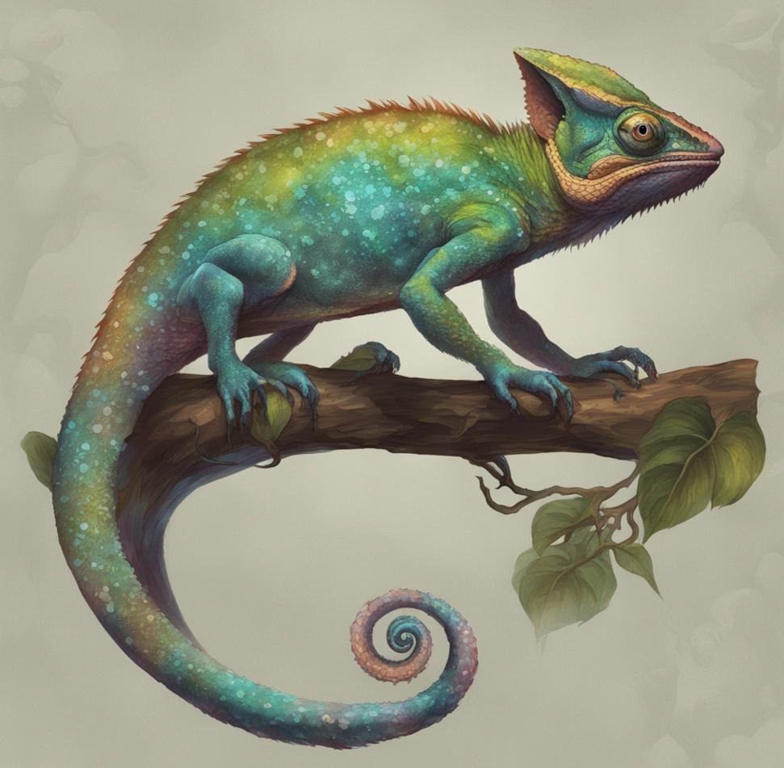
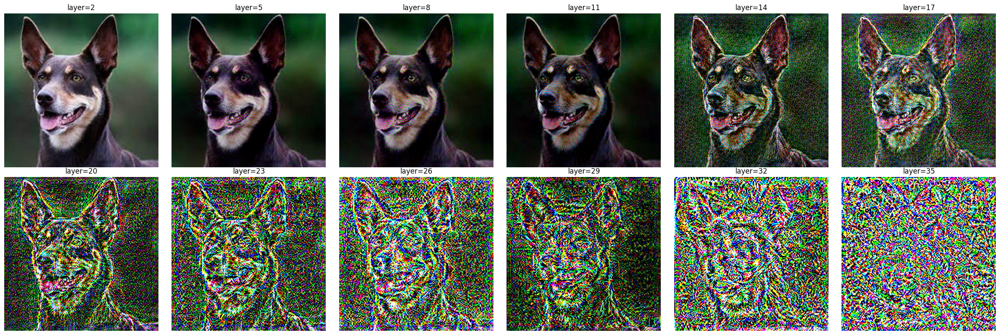
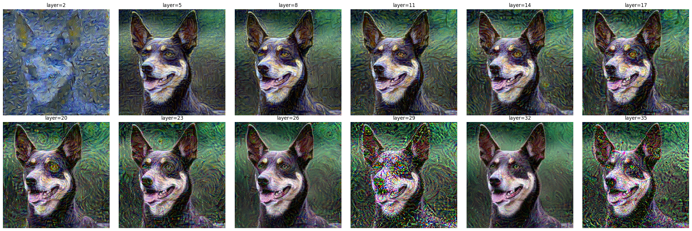
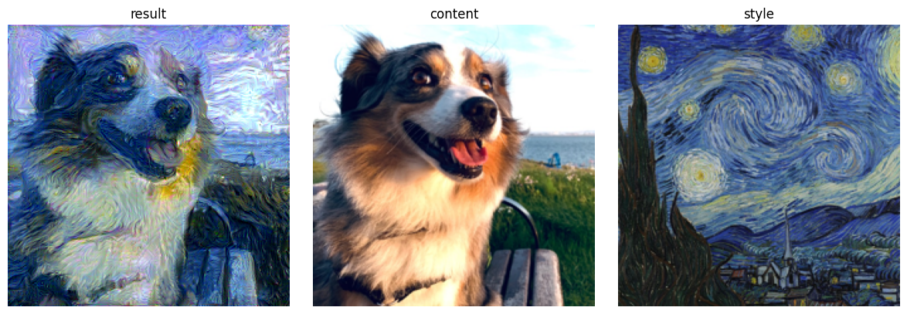
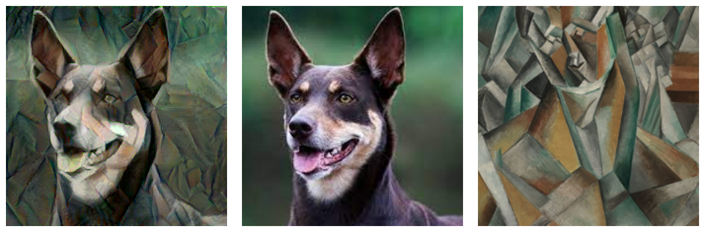

*Born of ancient magic, the Chromatic Chameleon prowls the shadows with scales that pulse and shimmer in a dance of arcane radiance. Its form, a living canvas, shifts through the hues of twilight, an elusive guardian draped in spectral energies. Only those with keen senses may glimpse the majestic, ever-changing creature lurking in the mystic realms.*



## The Quest
Repurpose an image classifier to do style transfer from a donor style image to a receiver content image.

## Neural Style Transfer
At a conceptual level, we want to feed the content and style images to the network and snapshot activations values of the inner layers of the image classifier. Merge them. And recreate an image through gradient descent to contain aspects of both at the same time.

### Hook into the image classifier
First we need to hook into the classifier to get access to the activation values of the network

```python
def hook(layer, k, mem=None):
    if mem is None: mem = {}
    def f(module, input, output):
        mem[k] = output
    layer.register_forward_hook(f)
    return mem

def hooked(model):
    m = copy.deepcopy(model).to(device)
    mem = {}
    for layer in range(37):
        mem = hook(m.features[layer], layer, mem=mem)
    return mem, m
```

### Extract the content: Image Compression
The first step is to extract the features that are relevent to the content image. This could also be reframed as a compression problem. Can we take the activation values from an inner layer of the network and use them to reconstruct the original image.

```python
def apply_content(start, content, layer=content_layer, epochs=10, m=vgg_hooked, mem=vgg_mem):
    activations = save_activations(content)
    # move to device
    start = copy.deepcopy(start.detach()).to(device).requires_grad_()
    target = activations[layer].to(device)
    m = m.to(device)
    m.eval()
    # optimizer
    optimizer = torch.optim.LBFGS([start])
    for epoch in tqdm(range(epochs)):
        def closure():
            m(start)
            predicted = mem[layer]
            loss = F.mse_loss(predicted, target)
            optimizer.zero_grad()
            loss.backward()
            return loss
    
        optimizer.step(closure)
        start.data = torch.clip(start, 0.0, 1.0).data
    return start
```



The earlier layers are fairly big and it's easy to reconstruct a good version of the original image, but later ones are much smaller and a lot of the details are lost. "Creating progressively noisier and noisier images.

### Extract the style: Gram matrix
For the style we do not want to recreate the original image. We only care about its essence. We care about how features relate to each other. And for that we compute the `Gram matrix` (aka. covariance, aka. correlation) between the channels at a given layer.

The idea is to capture the relation between features of a painting. For example the yellow stars and moon are correlated with convex radiant shapes, while the blue are swirly spirals, and the vegetation is weavy.


The similarity between two channels is computed by taking their dot product. We can do it for all pairs by doing a matrix multiplication `Channels @ Channels.T`.

```python
def gram(layer):
  n_channel = layer.shape[1]
  layer = layer.view(n_channel, -1)
  layer = layer / (layer.norm(dim=1, keepdim=True) + 1e-8) # normalize to 1 and avoid division by 0
  res = layer @ layer.T
  return res
```

We then chose a combination of layers to extract the style from (e.g. `style_layers = [1, 6, 11, 20, 29]`). Keeping in mind that very firsts layers have color information, early layers basic shapes, and more and more composit patterns.

```python
def apply_style(start, style, layers=style_layers, epochs=10, m=vgg_hooked, mem=vgg_mem):
    activations = save_activations(style)
    # move to device
    start = copy.deepcopy(start.detach()).to(device).requires_grad_()
    targets = [gram(activations[layer]).to(device) for layer in layers]
    m = m.to(device)
    m.eval()
    # optimizer
    optimizer = torch.optim.LBFGS([start])
    for epoch in tqdm(range(epochs)):
        def closure():
            m(start)
            predictions = [gram(mem[layer]) for layer in layers]
            losses = [F.mse_loss(predicted, target) for predicted, target in zip(predictions, targets)]
            loss = torch.stack(losses).sum()
            optimizer.zero_grad()
            loss.backward()
            return loss

        optimizer.step(closure)
        start.data = torch.clip(start, 0.0, 1.0).data
    return start
```

Let's have a look at some style extractions from Van Gogh's Stary Night painting applied to a dog picture.



### Putting it together
Now we can mix both the re-construction of the content, and the essence of the style together. Also known as neural style transfer.

```python
style_layers = [1, 6, 11, 20, 29]
content_layer = 28

def style_transfer(start, content, style, scaler=1., content_layer=content_layer, style_layers=style_layers, epochs=10, m=vgg_hooked, mem=vgg_mem):
    content_activations = save_activations(content)
    style_activations = save_activations(style)
    # move to device
    start = copy.deepcopy(start.detach()).to(device).requires_grad_()
    content_target = content_activations[content_layer].to(device)
    style_targets = [gram(style_activations[layer]).to(device) for layer in style_layers]
    m = m.to(device)
    m.eval()
    # optimizer
    optimizer = torch.optim.LBFGS([start])
    for epoch in tqdm(range(epochs)):
        def closure():
            m(start)
            # content loss
            content_predicted = mem[content_layer]
            content_loss = F.mse_loss(content_predicted, content_target)
            # style loss
            style_predictions = [gram(mem[layer]) for layer in style_layers]
            style_losses = [F.mse_loss(predicted, target) for predicted, target in zip(style_predictions, style_targets)]
            style_loss = torch.stack(style_losses).sum()
            # merge losses
            loss = content_loss + scaler * style_loss
            optimizer.zero_grad()
            loss.backward()
            return loss

        optimizer.step(closure)
        start.data = torch.clip(start, 0.0, 1.0).data
    return start
```




Good artists borrow, great artists steal, Neural networks compute Gram matrix.

## The code
You can get the code at https://github.com/peluche/neural-style-transfer
