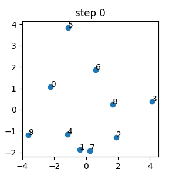
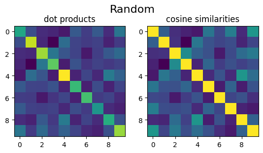
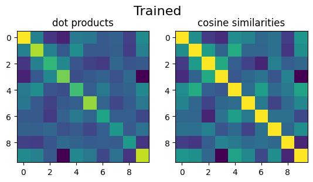
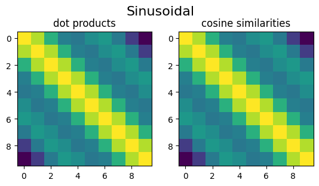
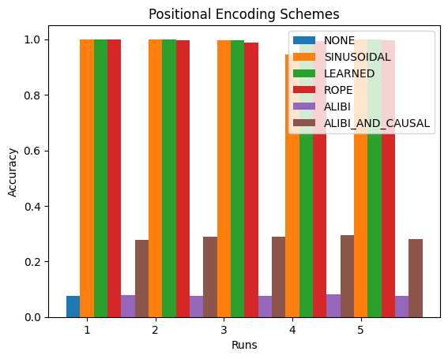
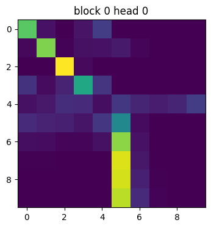
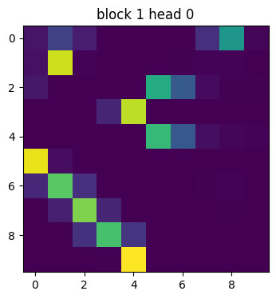

*In the dimly lit chambers of his ancient library, the wizard Eldron carefully weaves his spell over a complex array of arcane symbols. With each precise gesture, he transmutes these symbols, imbuing them with a hidden layer of meaning: the magic of positional encoding. This enchantment allows the symbols to hold not just the essence of words, but also their place in the grand tapestry of language. Eldron's eyes gleam with satisfaction as the embeddings shimmer, now ready to reveal their secrets in perfect harmony and sequence.*


## The Quest
Eldron left many manuscripts of his work on positional encoding. Figure out the intricacy of his spells and compare their efficacy.

## Toy problem: Copy-Task
To illustrate the different positional encoding schemes we will work on a toy problem.

The task is to replicate the input sequence before the special `<copy>` token, up to the end of the padding.

e.g.:
```ascii
1 7 2 <copy> _ _ _ _ _ _ →  1 7 2 <copy> 1 7 2 _ _ _
9 <copy> _ _ _ _ _ _ _ _ →  9 <copy> 9 _ _ _ _ _ _ _
2 2 4 3 <copy> _ _ _ _ _ →  2 2 4 3 <copy> 2 2 4 3 _
1 2 3 4 5 6 7 <copy> _ _ →  1 2 3 4 5 6 7 <copy> 1 2
```

### why this task?
I chose this task because it requires attention and some awarness of position to be solvable.
- The offset of the `<copy>` is variable between examples so the model cannot hardwire inputs to outputs, so self-attention is important.
- The problem is not well suited for a bag of words approach because order is very important, so positional encoding is important.

### why Encoder instead of Decoder?
For this task we chose to use an encoder-only transformer. Taking a sequence of tokens, a single copy token, and several padding tokens as input and producing the entire resulting sequence in a single pass.

The reason we are not using an autoregressive decoder-only model for this is because the first half of the problem is unlearnable with a causal mask.

let's imagine what the equivalent training set would be for:
```ascii
2 7 4 3 <copy> _ _ _ _ _ →  2 7 4 3 <copy> 2 7 4 3 _
```

Using a causal mask with a decoder-only autoregressive transformer would be equivalent to ask the model to predict all these pairs of input / labels:
```ascii
2                        →  7
2 7                      →  7 4
2 7 4                    →  7 4 3
2 7 4 3                  →  7 4 3 <copy>
2 7 4 3 <copy>           →  7 4 3 <copy> 2
2 7 4 3 <copy> _         →  7 4 3 <copy> 2 7
2 7 4 3 <copy> _ _       →  7 4 3 <copy> 2 7
2 7 4 3 <copy> _ _ _     →  7 4 3 <copy> 2 7 4 
2 7 4 3 <copy> _ _ _ _   →  7 4 3 <copy> 2 7 4 3
2 7 4 3 <copy> _ _ _ _ _ →  7 4 3 <copy> 2 7 4 3 _
```

And the problem here is that the first 4 pairs are not possible to guess. There is equal probability (10%) to chose the correct next token. Once the `<copy>` token appear in the input the output becomes totally inferable. But before that it's a coin toss. So decoder-only are not a good fit.

## Sinusoidal
The first positional encoding proposed in the Attention Is All You Need paper is Sinusoidal. It consist of taking a bunch of offsets on a set of `sin()` and `cos()` waves with increasing frequencies as a representation of the position of a given word.

Intuitively it bothers me. I have the sentiment that it creates a failure mode where the network just "duplicate" tokens. Where token `1` at offset 0 is a different token from `1` at offset 1 or 2 ..., conceptually duplicating the vocabulary for each possible offset in the context window.

*But Eldron's manuscripts are littered with references to it, so let's cast the spell to get a better feel of it.*

```python
def get_sinusoidal_positional_encoding(context_size=CONTEXT_SIZE, embed_size=EMBED_SIZE):
  position = torch.arange(context_size).unsqueeze(1)
  div_term = torch.exp(torch.arange(0, embed_size, 2) * -(math.log(10000.0) / embed_size))
  positional_encoding = torch.zeros(context_size, embed_size)
  positional_encoding[:, 0::2] = torch.sin(position * div_term)
  positional_encoding[:, 1::2] = torch.cos(position * div_term)
  return positional_encoding.to(device)

class Net(nn.Module):
  def __init__(self):
    # <...>
    self.positional_embedding = get_sinusoidal_positional_encoding()
    # <...>

  def forward(self, x):
    x = self.token_embedding(x)  # (batch_size, context_size, embedding_size)
    # sinusoidal positional encoding
    x = x + self.get_positional_embedding()
    # <...>
```

## Learned
Learned positional encoding are similar in concept. But instead of hardcoding the values we let the network learn whatever it prefers.

```python
class Net(nn.Module):
  def __init__(self):
    # <...>
    self.positional_embedding = nn.Embedding(context_size, embed_size)      
    # <...>

  def forward(self, x):
    x = self.token_embedding(x)  # (batch_size, context_size, embedding_size)
    # learned positional encoding
    x = x + self.positional_embedding(torch.arange(0, self.context_size).to(device))
    # <...>
```

### Visualize the Learned positional encodings
In our case what the network prefers is:



### Compare the 2 schemes
Looking at the similarities (dot product and cosine similarity) for different positional offsets




## RoPE
RoPE is a scheme that plugs inside the Attention block and is based on rotation instead of translation.

Intuitively I like the idea to not "pollute" the residual stream of embeddings. Only applying the transformation to the `Query` and `Key` inside the attention block.

### Using a giant rotation matrix (Slow)
```python
# slow (but intuitive?) using matrix multiplication for the rotations
# e.g. of rotation matrix for embed_size=4
# [[cos(t),   -sin(t),          0,          0],
#  [sin(t),    cos(t),          0,          0],
#  [     0,         0,    cos(t2),   -sin(t2)],
#  [     0,         0,    sin(t2),    cos(t2)]]
def get_rotation_matrix(m, embed_size=EMBED_SIZE):
  thetas = torch.tensor([10000 ** (-(2 * (i // 2)) / embed_size) for i in range(embed_size)])
  thetas *= m
  rotation = torch.eye(embed_size)
  rotation *= thetas.cos()
  col_vals = torch.arange(0, embed_size, 2)
  row_vals = col_vals + 1
  rotation[col_vals, row_vals] = -thetas.sin()[::2]
  rotation[row_vals, col_vals] = thetas.sin()[::2]
  return rotation.T

def get_rotation_matrices(context_size=CONTEXT_SIZE, embed_size=EMBED_SIZE):
  rotations = [get_rotation_matrix(m, embed_size) for m in range(context_size)]
  return torch.stack(rotations).to(device)
```

### Using the fast way
```python
# e.g. for embed_size=4
# | x1 |         | cos(t)  |         | -x2 |         | sin(t)  |
# | x2 |    *    | cos(t)  |    +    |  x1 |    *    | sin(t)  |
# | x3 |         | cos(t2) |         | -x4 |         | sin(t2) |
# | x3 |         | cos(t2) |         |  x3 |         | sin(t2) |
def get_efficient_rotation_matrix(context_size, embed_size=EMBED_SIZE):
  thetas = torch.tensor([10000 ** (-(2 * (i // 2)) / embed_size) for i in range(embed_size)])
  cos_ = [(m * thetas).cos() for m in range(context_size)]
  sin_ = [(m * thetas).sin() for m in range(context_size)]
  return torch.stack(cos_).to(device), torch.stack(sin_).to(device)

def compute_efficient_rotation_matrices(x):
  B, C, E = x.shape
  cos_, sin_ = get_efficient_rotation_matrix(C, E)
  x1 = x[:, :, ::2]
  x2 = -x[:, :, 1::2]
  y = torch.stack((x2, x1), dim=-1).view(B, C, E)
  rotated = x * cos_ + y * sin_
  return rotated

def apply_rope(x, fast=True):
  if fast: return compute_efficient_rotation_matrices(x)
  B, C, E = x.shape
  return (x.view(B, C, 1, E) @ get_rotation_matrices(C, E)).view(B, C, E)
```

### Applying it in the Attention code
```python
class MultiheadAttention(nn.Module):
  def __init__(self):
    # <...>

  def forward(self, x):
    B, C, E = x.shape
    # pre-layernorm
    x = self.ln(x)
    q, k, v = self.qkv(x).chunk(3, dim=-1)
    # --- RoPE ---
    q = apply_rope(q)
    k = apply_rope(k)
    # <...>
```

## ALiBi
ALiBi is also applied in the Attention block, but this time it's applied on top of the `Attention Scores` instead of the `Query` and `Key`. It is meant to represent the relative distance between tokens instead of the absolute position of a token in the sequence.

Intuitively this is very seductive. Relative position means that it should not "duplicate" tokens, and in theory it should scale to arbitrary offsets (for arbitrary context size). On the flip side it seems to me to be a very "weak" way to signal position. It influences how relevant a token is to the current one based on distance. This seems pretty fuzzy, and not a robust way to encode distance.

```python
# e.g.: 4-dimensional mask for decoder-only
# [[ 0., -0., -0., -0.],
#  [-1.,  0., -0., -0.],
#  [-2., -1.,  0., -0.],
#  [-3., -2., -1.,  0.]]
#
# e.g.: 4dimensional mask for encoder-only
# [[ 0., -1., -2., -3.],
#  [-1.,  0., -1., -2.],
#  [-2., -1.,  0., -1.],
#  [-3., -2., -1.,  0.]]

def alibi_distances(n_context, is_encoder=True):
    diag_dists = torch.cumsum(torch.triu(torch.ones(n_context, n_context).to(device)), dim=1) * -1
    diag_dists[diag_dists != 0] += 1

    dists = diag_dists.transpose(-2, -1)
    if is_encoder:
        dists = dists + diag_dists
    return dists

def alibi_scalers(n_heads):
    # vector with M values in a geometric sequence (starting at 2^-(8/n)) where n == number of heads.
    m_vector = 2 ** -((8 / n_heads) * torch.arange(1, n_heads + 1).to(device))
    return m_vector.view(-1, 1, 1) # reshape to broadcast correctly

def apply_alibi(correlation, is_encoder=True):
    n_context = correlation.shape[-1]
    n_heads = correlation.shape[-3]
    scaled_dists = alibi_scalers(n_heads) * alibi_distances(n_context, is_encoder)
    return correlation + scaled_dists

class MultiheadAttention(nn.Module):
  def __init__(self):
    # <...>

  def forward(self, x):
    # <...>
    correlation = q @ k.transpose(-2, -1)
    correlation = correlation / math.sqrt(k.shape[-1])
    # --- ALiBi ---
    correlation = apply_alibi(correlation)
    # --- Optionally apply causal mask ---
    if self.positional == Positional.ALIBI_AND_CAUSAL:
      mask = torch.tril(torch.ones(C, C)).to(device)
      correlation = correlation.masked_fill(mask == 0, float('-inf'))
    # <...>
```

## Compare Schemes Accuracies
On the toy task for a sample of 5 runs each we have:



I couldn't get ALiBi to produce good results on my task. This could be due to:
- Some bug in my code?
- The model being too small.
- The task could be a very bad fit for ALiBi.

I was advised to use a Causal mask in combination with ALiBi which helped a lot but didn't place it on a par with the other three.

I also experimented with using only powers of 2 number of multi-headed attention but it didn't close the gap with other schemes.

## Attention Activation
Looking at the attention activations for an example is pretty cool :)
```
7 1 8 2 <copy> _ _ _ _ _ → 
```



## Bonus Note about Transformers
I spent a lot of time getting no results until I got the godsent advice that: **One-layer models are such a special case -- they can't form induction heads**.

And you can read more about it in this [Anthropic paper](https://transformer-circuits.pub/2021/framework/index.html).

## The code
You can get the code at https://github.com/peluche/self-attention

## Sources
- Sinusoidal / Learned [Attention Is All You Need](https://arxiv.org/pdf/1706.03762.pdf)
- RoPE [RoFormer: Enhanced Transformer with Rotary Position Embedding](https://arxiv.org/pdf/2104.09864.pdf)
- ALiBi [Train Short, Test Long: Attention with Linear Biases Enables Input Length Extrapolation](https://arxiv.org/pdf/2108.12409.pdf)
- Ofir Press' [github](https://github.com/ofirpress/attention_with_linear_biases), [especially this issue](https://github.com/ofirpress/attention_with_linear_biases/issues/5), [blog](https://ofir.io/), and [YouTube](https://www.youtube.com/@ofirpress/videos)
- One-Layer Models being weird [A Mathematical Framework for Transformer Circuits](https://transformer-circuits.pub/2021/framework/index.html)
- Nelhage's [blog](https://blog.nelhage.com/)
