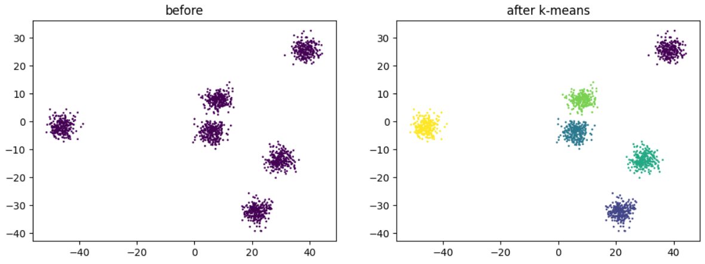
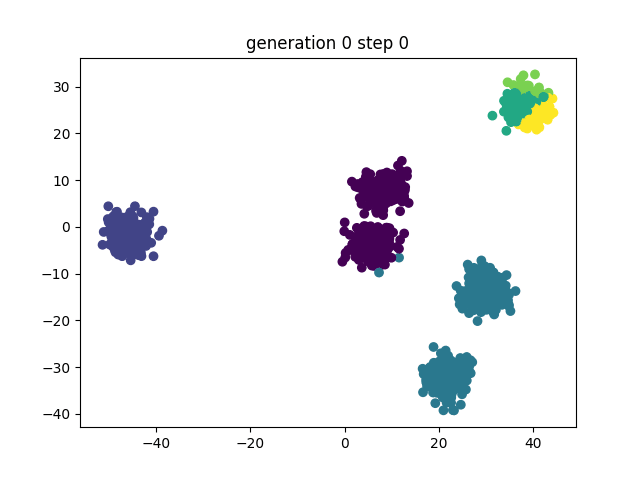
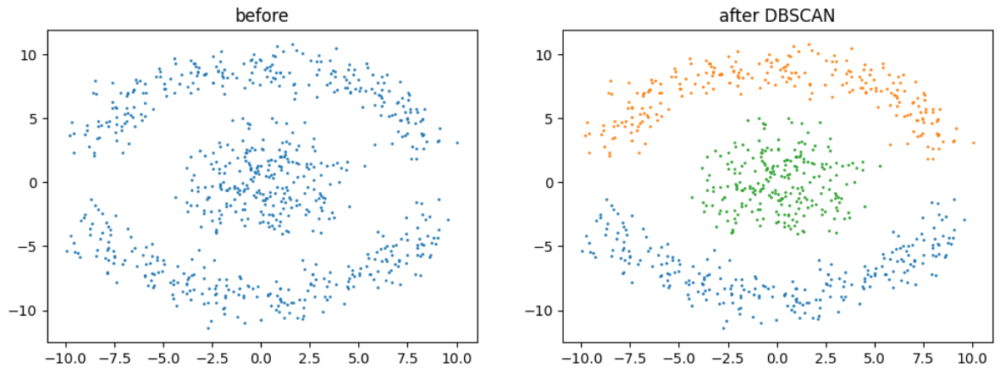
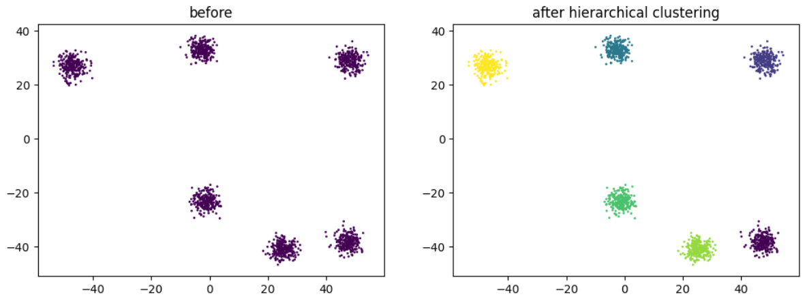
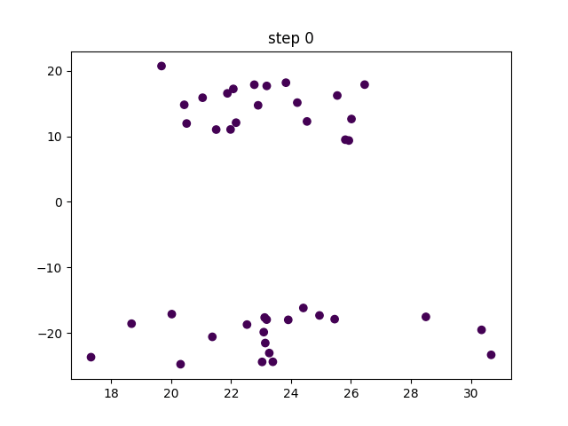
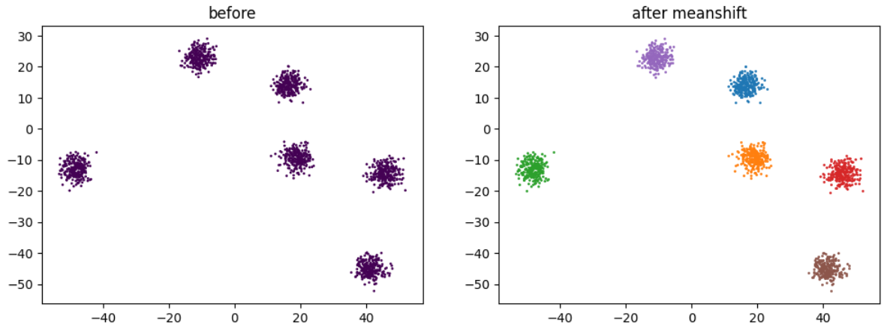
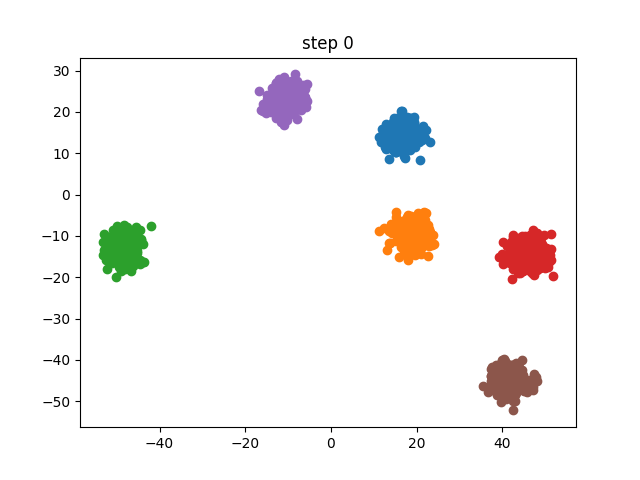

## The Quest
Get a feel for how unsupervised clustering algorithms work and their differences.

## Unsupervised Clustering
A set of algorithms used to identify groups within unlabeled dataset. If we go back to the word embeddings examples, running a clustering algorithm would return groups of words with similar meanings, or sharing a common topic (e.g. [king, queen, prince, princess], [apple, lemon, banana, coconut]).

Lets run through a few popular clustering algorithms.

## K-means
Chose `k` random points from the dataset as centroids of our k clusters. Greedily assign each point in the dataset to the closest centroid's cluster. Assign the new centroids to the mean of each cluster and repeat until we reach an equilibrium.

There is no guarantee for this solution to be any good, we selected the initial centoids at random. So the idea is to repeat the process a bunch of time, and stick with the solution that minimize sum of the clusters variance.

```python
def kmeans(data, n_clusters=n_clusters, n_iters=10):
    num_samples = data.shape[0]

    def f():
        old_cluster = torch.zeros(num_samples)
        centroids = data[torch.randperm(num_samples)[:n_clusters], :]
        while True: # repeat until stable
            distances = torch.cdist(data, centroids)
            clusters = distances.argmin(dim=1)
            if old_cluster.equal(clusters): return clusters
            old_cluster = clusters
            for i in range(n_clusters): # can we vectorize that?
                centroids[i] = data[clusters == i, :].mean(dim=0)

    def variance(clusters):
        return sum([data[clusters == i, :].var(dim=0).sum() for i in range(n_clusters)])

    return min([f() for _ in range(n_iters)], key=variance)
```



In this animation we can see the process happening under the hood over several generations or random starting points.



## DBSCAN
DBSCAN (Density-Based Spatial Clustering of Applications with Noise) is a clustering algorithm that works better than k-means for nested clusters. It also does not require to chose how many clusters we expect in advance.

It works by classifying each points as `core point` if they have at least `min_points` within `epsilon` distance, and `non-core point` otherwise.

Then picking a random core point to become a cluster, and recursively glue neighboring core points to it, and (non-recursively) glue non-core points to it. Repeat until there's no core point unasigned.

```python
# make a crappy hashable version of tensor because float precision keep biting me
def h(t):
    return f'{t}'

def dbscan(data, eps=1, min_points=4):
    # classify points as core or non-core
    core, non_core = [], set()
    for p in data:
        if (torch.norm(data - p, dim=1) < eps).sum() >= min_points:
            core.append(p)
        else:
            non_core.add(p)
    # build clusters
    seen = set()
    clusters = []
    while core:
        p = core.pop()
        if h(p) in seen: continue
        clusters.append([])
        q = [p]
        while q:
            p = q.pop()
            if h(p) in seen: continue
            seen.add(h(p))
            clusters[-1].append(p)
            if p in non_core: continue
            neighbors = data[(torch.norm(data - p, dim=1) < eps).nonzero().view(-1)]
            q.extend(neighbors)
        clusters[-1] = torch.stack(clusters[-1])
    return clusters
```



### Hyperparameters heuristics
`epsilon`: One common approach is to use the k-distance graph to determine an appropriate value for epsilon. The idea is to plot the distance to the kth nearest neighbor for each point in the dataset and look for a knee or elbow point in the graph. This knee point can be a good estimate for epsilon.

`min_points`: A common rule of thumb is to set min_points to the dimensionality of your dataset plus one (`min_points ≥ D + 1`), where D is the number of features. However, you may need to adjust this based on the density and distribution of your data.

## Hierarchical Clustering
This one sounds like a case study for union-find with path compression. Compute all distance pairs, merge the two closest points into a cluster. Rince and repeat.

There's 3 main options to compare a point to a cluster:
- centroid: take the average of the cluster
- single-linkage: the closest point in each cluster (this seems like the most computationaly efficient to me)
- complete-linkage: the furthest point in each cluster (and this one the most inneficient)

There's also options to compute the distance e.g.:
- Euclidean
- Manathan
- Cosine

I wanted to flex my tensor muscle and try to write a vectorized version of the code, but note that it is a bad idea, and union-find would have a much better complexity.

```python
# WARNING: this is horribly slow, the complexity is terrible, and it should use union-find with path compression.
@torch.no_grad()
def hierarchical_clustering(data, n_clusters=6):
    num_samples = data.shape[0]
    distances = torch.cdist(data, data) # pairwise distances
    mask = torch.zeros_like(distances).fill_diagonal_(math.inf) # mask the diagonal (we don't care about distance to self)
    clusters = torch.arange(num_samples) # everything is its own cluster

    for _ in range(num_samples - n_clusters):
        am = (distances + mask).argmin() # find the shortest pair of clusters
        i, j = am // num_samples, am % num_samples # emulate a divmod here

        # mask the merged cluster i
        mask[i] = math.inf
        mask[:, i] = math.inf

        # update the distances, by merging cluster i into j
        # - torch.min() for single-linkage clustering
        # - torch.max() for complete-linkage clustering
        distances[j] = torch.min(distances[i], distances[j])

        # everything that was in cluster i, is now in cluster j
        clusters = torch.where(clusters == clusters[i], clusters[j], clusters)
    return clusters
```



Step by step it looks like:



## Meanshift
Meanshift like DBSCAN does not require to provide the number of clusters (`k`) in advance.

It has an after taste of physics gravity simulation. For each point compute a new position as the weighted average of the distances to every other point. With further points having less influence on the average.

The distance decay uses a Gaussian kernel $e^{-\frac{||x - x'||^2}{2\sigma^2}} \over {x'\sqrt{2\sigma^2\pi}}$

```python
def gaussian(d, bw):
    return torch.exp(-0.5*((d/bw))**2) / (bw*math.sqrt(2*math.pi))

def one_update(X):
    for i, x in enumerate(X):
        dist = torch.norm(X - x, dim=1)
        weights = gaussian(dist, 2.5)
        X[i] = (X * weights.unsqueeze(1)).sum(dim=0) / weights.sum()

def meanshift(data, n_iter=5):
    X = data.clone()
    for it in range(n_iter):
        one_update(X)
    return X
```



Animating the points of each clusters zero-ing in on the centroids.



## The code
You can get the code at:
- https://github.com/peluche/ml-misc/blob/master/kmeans.ipynb
- https://github.com/peluche/ml-misc/blob/master/dbscan.ipynb
- https://github.com/peluche/ml-misc/blob/master/hierarchical_clustering.ipynb
- https://github.com/peluche/ml-misc/blob/master/meanshift.ipynb
