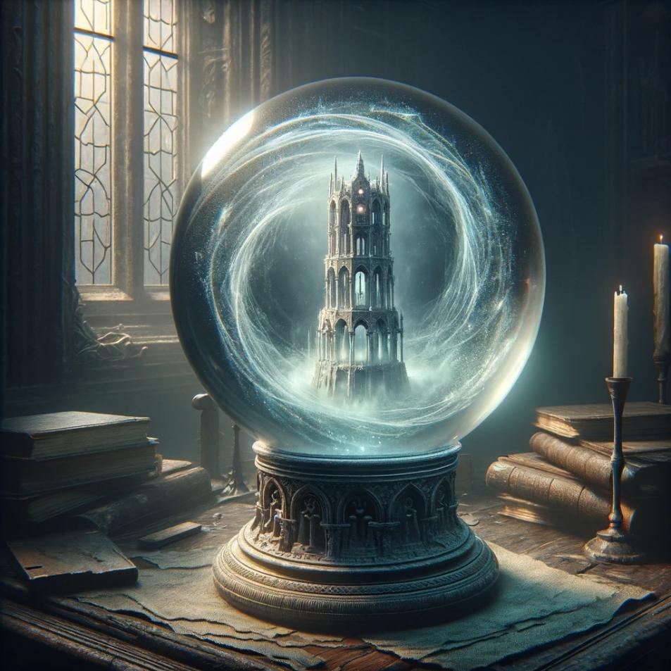
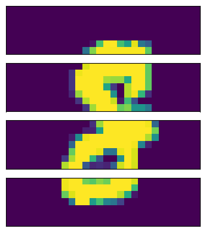
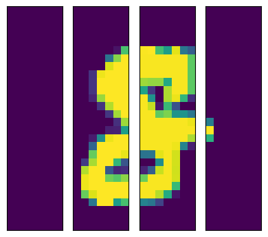
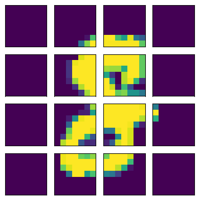
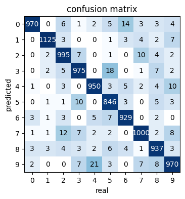
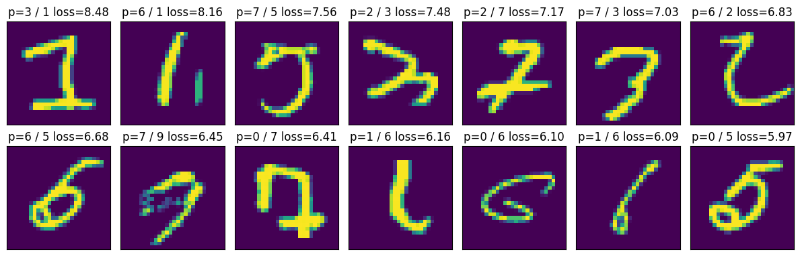
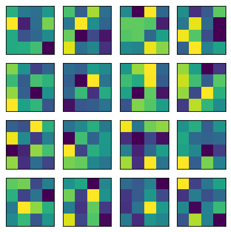
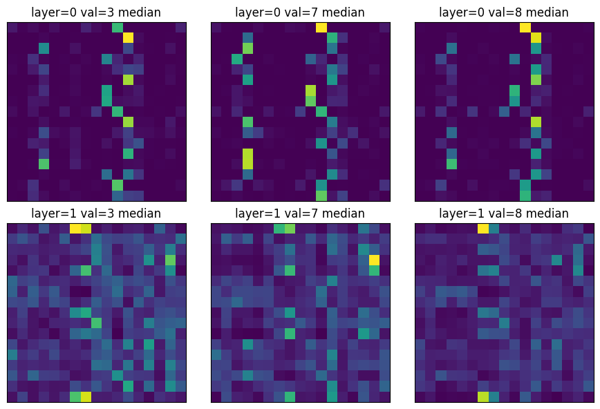
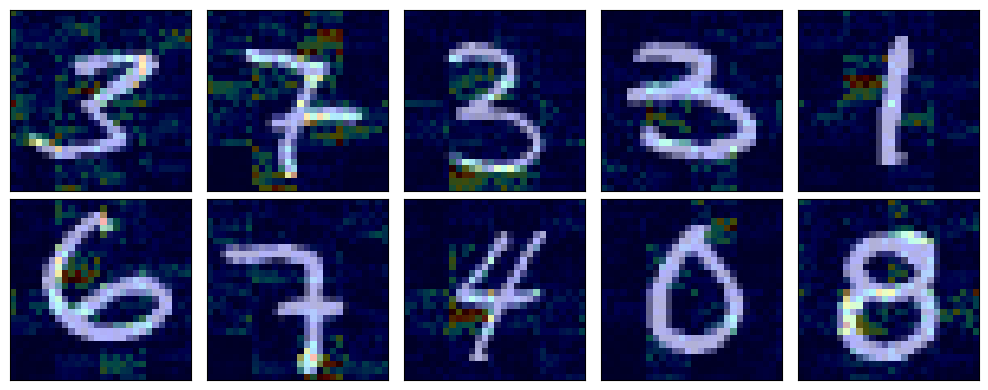

*Veiled in a mist of arcane energy, the Orb of Scrying rests silently upon its ancient pedestal. Crafted from crystal as clear as mountain spring water, it waits for the touch of a seer. To the untrained eye, it's merely a beautiful artifact, but to a wielder of magic, it's a window to the unseen. Whispering the old words, the mage's eyes lock onto the orb's depths. Visions swirl within, revealing secrets hidden across lands and time, as the orb bridges the gap between the known and the unknown.*



## The Quest
Use a ~~scrying orb~~ transformer to classify images.

## Principle
Transformers have been taking over all the sequences tasks. Until some clever folk decided it should also take over the vision world.

The trick proposed is to chunk the image into small tiles. Think of the tiles as a sequence of "words". Feed them to a transformer, and let the magic happen.

## Chunking Images
Let's cut images in different ways to build intuition.

### Horizontally
By hands
```python
b, c, h, w = images.shape
horizontal = images.view(b, c, 4, h // 4, w).permute(0, 2, 1, 3, 4)
```

Or using `einops`
```python
horizontal = einops.rearrange(images, 'b c (k h) w -> b k c h w', k=4)
```



### Vertically
By hands
```python
b, c, h, w = images.shape
vertical = images.view(b, c, h, 4, w // 4).permute(0, 3, 1, 2, 4)
```

Or using `einops`
```python
vertical = einops.rearrange(images, 'b c h (k w) -> b k c h w', k=4)
```



### Tiles
By hands
```python
b, c, h, w = images.shape
tile_size = 7
tiles = images.view(b, c, h // tile_size, tile_size, w // tile_size, tile_size).permute(0, 2, 4, 1, 3, 5).reshape(b, -1, c, tile_size, tile_size)

```

Or using `einops`
```python
tile_size = 7
tiles = einops.rearrange(images, 'b c (h t1) (w t2) -> b (h w) c t1 t2', t1=tile_size, t2=tile_size)
```



## Model
The individual tiles are flattened and passed into a fully connected layer to be converted into `embed_size` N-dimensional vectors. This step is similar to the "embedding" step for text transformers.

A `CLS` token is added in the front. This is where we will read the label prediction at the end of the pipeline. Adding an extra token gives a place for the network to store intermediate states without worrying of the pixel content of any particular tile exercising more influence than the others. This `CLS` token is treated as one more learnable attribute of the network.

```python
class Net(nn.Module):
  def __init__(self, ...):
    super().__init__()
    self.positional_embedding = nn.Embedding(context_size, embed_size)
    self.tile_embedding = nn.Linear(TILE_SIZE * TILE_SIZE * CHANNEL, embed_size)
    self.cls_token = nn.Parameter(torch.randn(1, 1, embed_size))
    ...

  def forward(self, x):
    # (batch_size, channel, height, width)
    # split into tiles/patches/chunks
    x = einops.rearrange(x, 'b c (h t1) (w t2) -> b (h w) (c t1 t2)', t1=self.tile_size, t2=self.tile_size)
    # embed
    x = self.tile_embedding(x)
    # add cls token
    cls_token = self.cls_token.expand(x.shape[0], -1, -1)
    x = torch.cat((cls_token, x), dim=1)
    # positional encoding
    x = x + self.get_positional_embedding()
    ...
```

## Evaluate the Model
Train the model for a few hundreds epochs and it gets to ~97% accuracy on the validation set. We can get a better ideas of the failure cases by looking at the confusion matrix.



Or visualizing the images with the worst loss.



There's still room for improvement. But I'd argue that some of them are pretty fishy.

## Internals of the Model
### Positional Encoding
I used learned positional encoding and we can look at what encodings have been learned.



Visualizing didn't help me much here. I can't pickup a pattern at a glance.

### Attention by Label
Comparing the median Attention Activations for a very small 2 layers single-headed ViT. For three classes of labels: `3`, `7`, and `8`.



Once again I was expecting to find more differences. I don't have a pattern jumping to my eyes.

### Heatmap
Instead we can visualize what pixels were the most important in deciding the label for an image.



This is also not what I was expecting. But this time I see a few interesting patterns:
- The tiles are visible in the heatmap because of the self-attention.
- `1` are looking for an horizontal line to the left of their center, and I believe this is to detect the absence of the branch of a `4` or the cross bar of a `7`.

This was particularly surprising to me because most of the decisions seems to be taken by "what is missing" instead of "what is present" in the picture.

## The code
You can get the code at https://github.com/peluche/ViT

## Sources
An Image is Worth 16x16 Words: https://arxiv.org/pdf/2010.11929.pdf
